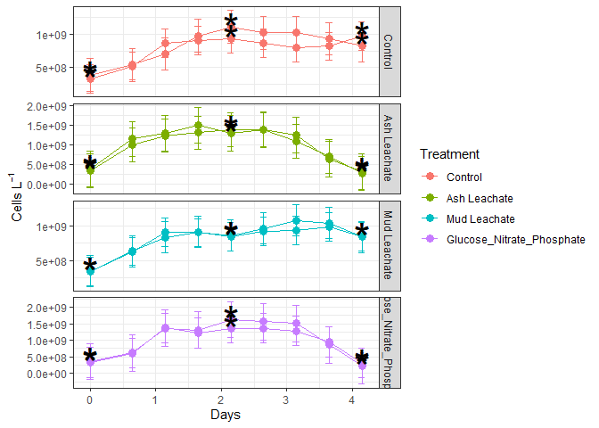
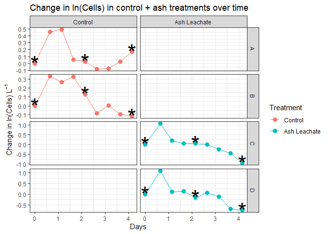
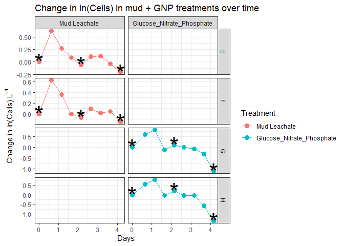
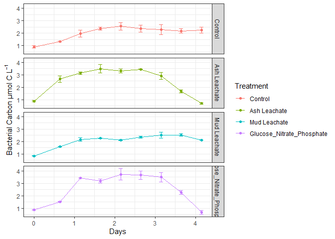
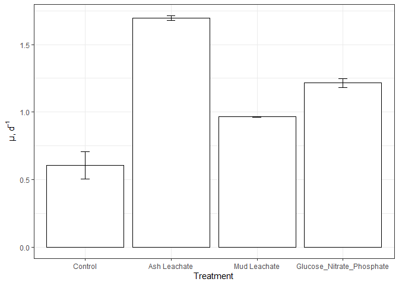
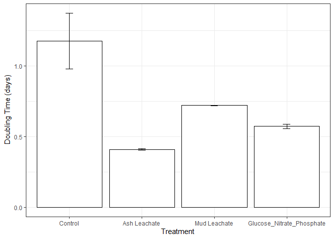
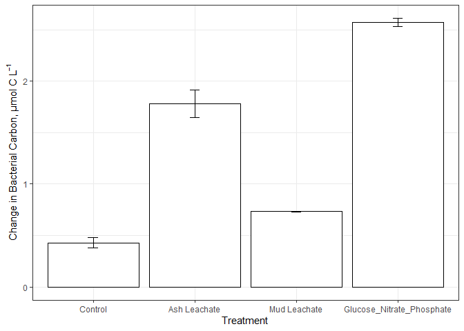
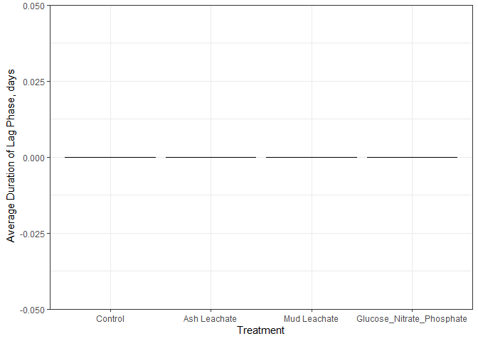
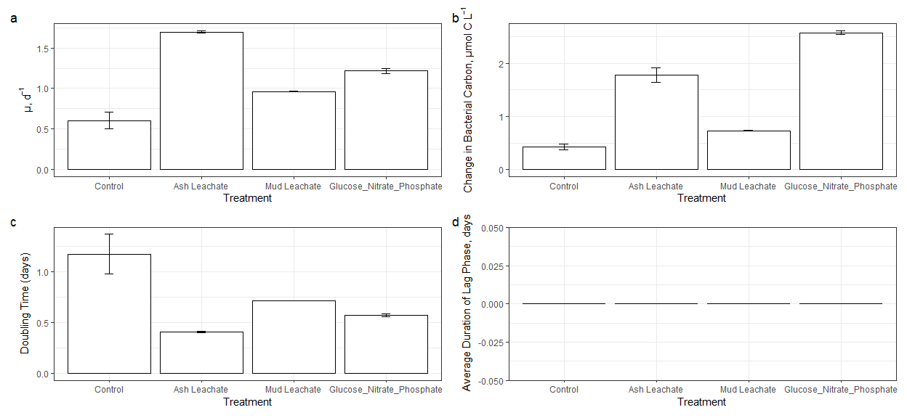

Bacterial Abundance Analysis
================
Kai Oda
10/21/2020

## Loading in the data

``` r
# First let's see what sheets are within the xcel file that we will be working with 
excel_sheets("../Input_Data/week3/144L_2018_BactAbund.xlsx")
```

    ## [1] "Metadata" "Data"

``` r
#Import the metadata 
metadata <- read_excel("../Input_Data/week3/144L_2018_BactAbund.xlsx", sheet="Metadata")

#unique treatments 
unique(metadata$Treatment)
```

    ## [1] "Control"                   "Ash Leachate"             
    ## [3] "Mud Leachate"              "Glucose_Nitrate_Phosphate"

Properties of this dataset

  - Only **1 location** and one depth is sampled
  - There are **8 bottles** labeled (A-H)
  - There are **9 timepoints** taken for each bottle
  - There are **4 treatments.** Control, ash leachate, mud leachate and
    the GNP mix.
  - There are **3 DNA samples** taken per bottle.

<!-- end list -->

``` r
# Import the actual data 
data <- read_excel("../Input_Data/week3/144L_2018_BactAbund.xlsx", sheet="Data")

# Now, we join the actual data to the metadata 
joined <- left_join(metadata, data)
```

    ## Joining, by = c("Bottle", "Timepoint")

So now we have a dataset that contains the number of cells.
*left\_join()* synchronzied Cells\_ml by Bottle and Timepoint

## Data exploration/basic manipulation

``` r
str(joined)
```

    ## Classes 'tbl_df', 'tbl' and 'data.frame':    80 obs. of  17 variables:
    ##  $ Experiment          : chr  "144L_2018" "144L_2018" "144L_2018" "144L_2018" ...
    ##  $ Location            : chr  "Campus Point" "Campus Point" "Campus Point" "Campus Point" ...
    ##  $ Temperature         : num  20 20 20 20 20 20 20 20 20 20 ...
    ##  $ Depth               : num  1 1 1 1 1 1 1 1 1 1 ...
    ##  $ Bottle              : chr  "A" "A" "A" "A" ...
    ##  $ Timepoint           : num  0 1 2 3 4 5 6 7 8 9 ...
    ##  $ Treatment           : chr  "Control" "Control" "Control" "Control" ...
    ##  $ Target_DOC_Amendment: num  0 0 0 0 0 0 0 0 0 0 ...
    ##  $ Inoculum_L          : num  1.5 1.5 1.5 1.5 1.5 1.5 1.5 1.5 1.5 1.5 ...
    ##  $ Media_L             : num  3.5 3.5 3.5 3.5 3.5 3.5 3.5 3.5 3.5 3.5 ...
    ##  $ Datetime            : chr  "2018-10-15T16:30" "2018-10-16T08:00" "2018-10-16T20:00" "2018-10-17T08:00" ...
    ##  $ TOC_Sample          : logi  TRUE FALSE FALSE FALSE TRUE FALSE ...
    ##  $ Parallel_Sample     : logi  TRUE FALSE FALSE FALSE TRUE FALSE ...
    ##  $ Cell_Sample         : logi  TRUE TRUE TRUE TRUE TRUE TRUE ...
    ##  $ DNA_Sample          : logi  TRUE FALSE FALSE FALSE TRUE FALSE ...
    ##  $ DNA_SampleID        : chr  "144_A0_S6" NA NA NA ...
    ##  $ Cells_ml            : num  332532 523943 859020 906999 933025 ...

We need to:

  - Convert cells/mL -\> cells/L
  - Calculate duration between timepoints based on treatment and bottle
  - remove rows with NA values for cells

<!-- end list -->

``` r
cells <- joined %>% 
  mutate(Datetime = ymd_hm(Datetime), 
         cells_L = Cells_ml * 1000) %>% 
  drop_na(cells_L) %>% 
  group_by(Treatment, Bottle) %>% 
  mutate(interv = interval(first(Datetime), Datetime), 
         dur = as.duration(interv),
         days = as.numeric(dur, "days")) %>% 
  mutate(cells_sd = sd(cells_L)) %>% 
  ungroup() 
  

str(cells)
```

    ## Classes 'tbl_df', 'tbl' and 'data.frame':    72 obs. of  22 variables:
    ##  $ Experiment          : chr  "144L_2018" "144L_2018" "144L_2018" "144L_2018" ...
    ##  $ Location            : chr  "Campus Point" "Campus Point" "Campus Point" "Campus Point" ...
    ##  $ Temperature         : num  20 20 20 20 20 20 20 20 20 20 ...
    ##  $ Depth               : num  1 1 1 1 1 1 1 1 1 1 ...
    ##  $ Bottle              : chr  "A" "A" "A" "A" ...
    ##  $ Timepoint           : num  0 1 2 3 4 5 6 7 8 0 ...
    ##  $ Treatment           : chr  "Control" "Control" "Control" "Control" ...
    ##  $ Target_DOC_Amendment: num  0 0 0 0 0 0 0 0 0 0 ...
    ##  $ Inoculum_L          : num  1.5 1.5 1.5 1.5 1.5 1.5 1.5 1.5 1.5 1.5 ...
    ##  $ Media_L             : num  3.5 3.5 3.5 3.5 3.5 3.5 3.5 3.5 3.5 3.5 ...
    ##  $ Datetime            : POSIXct, format: "2018-10-15 16:30:00" "2018-10-16 08:00:00" ...
    ##  $ TOC_Sample          : logi  TRUE FALSE FALSE FALSE TRUE FALSE ...
    ##  $ Parallel_Sample     : logi  TRUE FALSE FALSE FALSE TRUE FALSE ...
    ##  $ Cell_Sample         : logi  TRUE TRUE TRUE TRUE TRUE TRUE ...
    ##  $ DNA_Sample          : logi  TRUE FALSE FALSE FALSE TRUE FALSE ...
    ##  $ DNA_SampleID        : chr  "144_A0_S6" NA NA NA ...
    ##  $ Cells_ml            : num  332532 523943 859020 906999 933025 ...
    ##  $ cells_L             : num  3.33e+08 5.24e+08 8.59e+08 9.07e+08 9.33e+08 ...
    ##  $ interv              :Formal class 'Interval' [package "lubridate"] with 3 slots
    ##   .. ..@ .Data: num  0 55800 99000 142200 185400 ...
    ##   .. ..@ start: POSIXct, format: "2018-10-15 16:30:00" "2018-10-15 16:30:00" ...
    ##   .. ..@ tzone: chr "UTC"
    ##  $ dur                 :Formal class 'Duration' [package "lubridate"] with 1 slot
    ##   .. ..@ .Data: num  0 55800 99000 142200 185400 ...
    ##  $ days                : num  0 0.646 1.146 1.646 2.146 ...
    ##  $ cells_sd            : num  2.11e+08 2.11e+08 2.11e+08 2.11e+08 2.11e+08 ...

## Basic data visualization

Normally, we could create a variable to store the order in which
elements should appear. Rather than set the levels in every plot I
decided to edit the column “Treatment” to display information in the
desired order. Therefore, the treatment variable appears in the
specified order **for all future figures.**

``` r
levels <- c("Control", "Ash Leachate", "Mud Leachate", "Glucose_Nitrate_Phosphate")

# This line orders the treatment variable by the specified order for all future figures
cells$Treatment <- factor(cells$Treatment, levels = levels)

cells %>% 
  mutate(dna = ifelse(DNA_Sample == TRUE, "*", NA)) %>% 
  ggplot(aes(x=days, y=cells_L, color=Treatment, 
             group = interaction(Treatment, Bottle)))+
  geom_point(size=3)+
  geom_errorbar(aes(ymin = cells_L - cells_sd, ymax = cells_L + cells_sd), width=0.1)+
  labs(x = "Days", y = expression(paste("Cells L"^-1)))+
  geom_line()+
  facet_grid(row="Treatment", scales="free")+
  geom_text(aes(label=dna), size=12, color="black")+
  theme_bw()
```

    ## Warning: Removed 48 rows containing missing values (geom_text).

<!-- -->

From the plot, it appears that Ash Leachate and GNP treatments had the
greatest abundance of bacterial cells (note the free y axis). The Mud
Leachate and Control treatments seem very similar, indicating that the
addition of mud leachate had little effect on bacterial abundance
(although a T test/One-way ANOVA + TuskeyHSD test is needed to say for
sure).

For the next part we need to plot the ln(cell\_abundance) vs time
(days). We will visually estimate where graph is linear. The slope of
this linear portion will give us the specific growth rate.

``` r
ln_cells <- cells %>% 
  group_by(Treatment, Bottle) %>% 
  mutate(ln_cells = log(cells_L), 
         diff_ln_cells = ln_cells-lag(ln_cells, default=first(ln_cells))) %>% 
  ungroup()
```

Once we have calculated the difference in the natural log of the cell
counts we can just plot the same graph and visually check for where the
lines appear linear.

``` r
# Trying to display all 4 treatments and bottles in one graph makes it impossible to distinguish the linear portion
## Therefore, I am trying to split the dataset into two treatments each to make it easier to visualize 
ln_control_ash <- ln_cells %>% 
  filter(Treatment %in% c("Control", "Ash Leachate"))

ln_control_ash %>% 
  mutate(dna = ifelse(DNA_Sample == TRUE, "*", NA)) %>% 
  ggplot(aes(x=days, y=diff_ln_cells, color=Treatment, 
             group = interaction(Treatment, Bottle)))+
  geom_point(size=3)+
  labs(x = "Days", y = expression(paste("Change in ln(Cells) L"^-1)), title="Change in ln(Cells) in control + ash treatments over time")+
  geom_line()+
  facet_grid(Bottle~Treatment, scales="free")+
  geom_text(aes(label=dna), size=12, color="black")+
  theme_bw()
```

    ## Warning: Removed 24 rows containing missing values (geom_text).

<!-- -->

``` r
# Second graph, showing mud and GNP solution 
ln_mud_GNP <- ln_cells %>% 
  filter(Treatment %in% c("Mud Leachate", "Glucose_Nitrate_Phosphate"))

ln_mud_GNP %>% 
  mutate(dna = ifelse(DNA_Sample == TRUE, "*", NA)) %>% 
  ggplot(aes(x=days, y=diff_ln_cells, color=Treatment, 
             group = interaction(Treatment, Bottle)))+
  geom_point(size=3)+
  labs(x = "Days", y = expression(paste("Change in ln(Cells) L"^-1)), title="Change in ln(Cells) in mud + GNP treatments over time")+
  geom_line()+
  facet_grid(Bottle~Treatment, scales="free")+
  geom_text(aes(label=dna), size=12, color="black")+
  theme_bw()
```

    ## Warning: Removed 24 rows containing missing values (geom_text).

<!-- -->

Based on the graphs the we can visually estimate where exponential
growth (the log phase) occurs for each bottle:

  - Control, Bottle A, \~0-0.5d (T0-T1)

  - Control, Bottle B, \~0-0.5d (T0-T1)

  - Ash Leachate, Bottle C, \~0-0.5d (T0-T1)

  - Ash Leachate, Bottle D, \~0-0.5d (T0-T1)

  - Mud Leachate, Bottle E, \~0-0.5d (T0-T1)

  - Mud Leachate, Bottle F, \~0-0.5d (T0-T1)

  - GNP, Bottle G, \~0-1d (T0-T2)

  - GNP, Bottle H, \~0-1d (T0-T2)

## Calculate growth rates, doubling times and change in cell abundances

``` r
growth <- ln_cells %>% 
  mutate(exp_start = 0, 
         exp_end = ifelse(Treatment=="Glucose_Nitrate_Phosphate", 2, 1)) %>% 
  group_by(Treatment, Bottle) %>% 
  mutate(ln_cells_exp_start = ifelse(exp_start == Timepoint, ln_cells, NA), 
         ln_cells_exp_end = ifelse(exp_end == Timepoint, ln_cells, NA), 
         cells_exp_start = ifelse(exp_start == Timepoint, cells_L, NA), 
         cells_exp_end = ifelse(exp_end == Timepoint, cells_L, NA), 
         days_exp_start = ifelse(exp_start == Timepoint, days, NA), 
         days_exp_end = ifelse(exp_end == Timepoint, days, NA),) %>%
  fill(ln_cells_exp_start:days_exp_end, .direction="downup") %>%
  fill(ln_cells_exp_end, .direction="updown") %>% 
  mutate(mew = (ln_cells_exp_end - ln_cells_exp_start)/(days_exp_end - days_exp_start), 
         doubling_time = log(2)/mew, 
         delta_cells = cells_exp_end - first(cells_L)) %>% 
  ungroup() 


check <- growth %>%  
  select(Treatment, Bottle, Timepoint, ln_cells, exp_start, exp_end, cells_exp_start, cells_exp_end, mew, doubling_time)
```

## Calculate Bacterical Carbon

  - Convert bacterial abundance and change in bacterial abundance to C
    units
  - Apply a C conversion factor to bacterial abundnace (cells/L)
  - This generates bacterial carbon (µmol C/L)

We will apply C content of bacterioplankton cells from Coastal Japan
(-10 fg C/cell)

  - Fukuda et. al., 1998

<!-- end list -->

``` r
batCarbon <- growth %>% 
  mutate(bc = cells_L * (2.5 * 10^-9), 
         deltaBc = delta_cells * (2.5*10^-9))

str(batCarbon)
```

    ## Classes 'tbl_df', 'tbl' and 'data.frame':    72 obs. of  37 variables:
    ##  $ Experiment          : chr  "144L_2018" "144L_2018" "144L_2018" "144L_2018" ...
    ##  $ Location            : chr  "Campus Point" "Campus Point" "Campus Point" "Campus Point" ...
    ##  $ Temperature         : num  20 20 20 20 20 20 20 20 20 20 ...
    ##  $ Depth               : num  1 1 1 1 1 1 1 1 1 1 ...
    ##  $ Bottle              : chr  "A" "A" "A" "A" ...
    ##  $ Timepoint           : num  0 1 2 3 4 5 6 7 8 0 ...
    ##  $ Treatment           : Factor w/ 4 levels "Control","Ash Leachate",..: 1 1 1 1 1 1 1 1 1 1 ...
    ##  $ Target_DOC_Amendment: num  0 0 0 0 0 0 0 0 0 0 ...
    ##  $ Inoculum_L          : num  1.5 1.5 1.5 1.5 1.5 1.5 1.5 1.5 1.5 1.5 ...
    ##  $ Media_L             : num  3.5 3.5 3.5 3.5 3.5 3.5 3.5 3.5 3.5 3.5 ...
    ##  $ Datetime            : POSIXct, format: "2018-10-15 16:30:00" "2018-10-16 08:00:00" ...
    ##  $ TOC_Sample          : logi  TRUE FALSE FALSE FALSE TRUE FALSE ...
    ##  $ Parallel_Sample     : logi  TRUE FALSE FALSE FALSE TRUE FALSE ...
    ##  $ Cell_Sample         : logi  TRUE TRUE TRUE TRUE TRUE TRUE ...
    ##  $ DNA_Sample          : logi  TRUE FALSE FALSE FALSE TRUE FALSE ...
    ##  $ DNA_SampleID        : chr  "144_A0_S6" NA NA NA ...
    ##  $ Cells_ml            : num  332532 523943 859020 906999 933025 ...
    ##  $ cells_L             : num  3.33e+08 5.24e+08 8.59e+08 9.07e+08 9.33e+08 ...
    ##  $ interv              :Formal class 'Interval' [package "lubridate"] with 3 slots
    ##   .. ..@ .Data: num  0 55800 99000 142200 185400 ...
    ##   .. ..@ start: POSIXct, format: "2018-10-15 16:30:00" "2018-10-15 16:30:00" ...
    ##   .. ..@ tzone: chr "UTC"
    ##  $ dur                 :Formal class 'Duration' [package "lubridate"] with 1 slot
    ##   .. ..@ .Data: num  0 55800 99000 142200 185400 ...
    ##  $ days                : num  0 0.646 1.146 1.646 2.146 ...
    ##  $ cells_sd            : num  2.11e+08 2.11e+08 2.11e+08 2.11e+08 2.11e+08 ...
    ##  $ ln_cells            : num  19.6 20.1 20.6 20.6 20.7 ...
    ##  $ diff_ln_cells       : num  0 0.4546 0.4944 0.0543 0.0283 ...
    ##  $ exp_start           : num  0 0 0 0 0 0 0 0 0 0 ...
    ##  $ exp_end             : num  1 1 1 1 1 1 1 1 1 1 ...
    ##  $ ln_cells_exp_start  : num  19.6 19.6 19.6 19.6 19.6 ...
    ##  $ ln_cells_exp_end    : num  20.1 20.1 20.1 20.1 20.1 ...
    ##  $ cells_exp_start     : num  3.33e+08 3.33e+08 3.33e+08 3.33e+08 3.33e+08 ...
    ##  $ cells_exp_end       : num  5.24e+08 5.24e+08 5.24e+08 5.24e+08 5.24e+08 ...
    ##  $ days_exp_start      : num  0 0 0 0 0 0 0 0 0 0 ...
    ##  $ days_exp_end        : num  0.646 0.646 0.646 0.646 0.646 ...
    ##  $ mew                 : num  0.704 0.704 0.704 0.704 0.704 ...
    ##  $ doubling_time       : num  0.985 0.985 0.985 0.985 0.985 ...
    ##  $ delta_cells         : num  1.91e+08 1.91e+08 1.91e+08 1.91e+08 1.91e+08 ...
    ##  $ bc                  : num  0.831 1.31 2.148 2.267 2.333 ...
    ##  $ deltaBc             : num  0.479 0.479 0.479 0.479 0.479 ...

## Calculating Treatment Averages

Now that we have verified that the data from each bottle seems valid, it
can be helpful to calculate the average values for important properties.
In the following code chunk we will calculate the average values and
standard deviation for:

  - Bacterial Carbon/cell
  - Specific growth rate
  - Doubling time
  - Change in cells over experiment
  - Change in cell C over experiment

As a bonus we can also calculate the average duration of the lag phase
over the course of the experiment

``` r
averages <- batCarbon %>% 
  group_by(Treatment, Timepoint) %>% 
  mutate(avg_bc = mean(bc), 
         sd_bc = sd(bc)) %>% 
  ungroup() %>% 
  group_by(Treatment) %>% 
  mutate(avg_mew = mean(mew), 
         sd_mew = sd(mew), 
         avg_doubling_time = mean(doubling_time), 
         sd_doubling_time = sd(doubling_time), 
         avg_delta_cells = mean(delta_cells), 
         sd_delta_cells = sd(delta_cells), 
         avg_delta_bc = mean(deltaBc), 
         sd_delta_bc = sd(deltaBc), 
         avg_lag_phase_dur = mean(days_exp_start)) %>% 
  ungroup()

subset <- averages %>% 
  select(Treatment, Timepoint, Bottle, bc, avg_bc, sd_bc)
```

Now that we have the dataset made with a bunch of average values we can
make a plot\!

First up, average carbon/cell

``` r
ggplot(averages, aes(x=days, y=avg_bc, color=Treatment))+
  geom_point()+
  geom_line()+
  geom_errorbar(aes(ymin= avg_bc - sd_bc, ymax = avg_bc + sd_bc), width=0.1)+
  facet_grid(row = "Treatment")+
  labs(x="Days", y=expression("Bacterial Carbon µmol C L"^-1))+
  theme_bw()
```

<!-- -->

This plot shows the average bacterial carbon for four different
treatments. It appears that **Ash Leachate** and **GNP** treatments had
the highest bacterial carbon/cell. Mud Leachate does not appear to be
significantly different from the Control treatment (statistical test
needed).

## Visualizing the rest of the data

We were able to plot average carbon/cell, but we have a bunch of other
values\! However, there is only one value for each treatment, so we will
be making use of a new graph…. The column graph\!

``` r
## First we need to subset the data to only include the variables of interest 
bar_data <- averages %>% 
  select(Location, Treatment, avg_mew:avg_lag_phase_dur)

## For further simplification we will only return unique values with the distinct() function 
bar_data <- bar_data %>% 
  distinct()
```

## Let’s start plotting\!

``` r
avg_mew <- ggplot(bar_data, aes(x=Treatment, y=avg_mew))+
  geom_col(fill="white", color="black")+
  geom_errorbar(aes(ymin=avg_mew-sd_mew, ymax = avg_mew + sd_mew), width=0.1)+
  labs(x="Treatment", y=expression("µ, d"^-1))+
  theme_bw()

avg_mew
```

<!-- -->

This graph represents “mew” or the specific growth rate. Ash Leachate
and GNP treatments had the highest specific growth rate, followed by Mud
Leachate and then the control. We can generally take this to mean that
Ash Leachate and GNP treatments experienced the fastest increase in
bacterial cell abundance.

*Note: Mud Leachate standard error was so small that it did not appear
on the graph. However, it is still there\!*

``` r
avg_doubling_time <- ggplot(bar_data, aes(x=Treatment, y=avg_doubling_time))+
  geom_col(fill="white", color="black")+
  geom_errorbar(aes(ymin=avg_doubling_time-sd_doubling_time, ymax = avg_doubling_time + sd_doubling_time), width=0.1)+
  labs(x="Treatment", y=expression("Doubling Time (days)"))+
  theme_bw()

avg_doubling_time
```

<!-- -->

The Control treatment had the greatest doubling time. This means that it
took the longest time for the population to double — it experienced the
slowest growth in its population. Ash Leachate and GNP treatments were
able to double their population in the shortest time frame\!

``` r
avg_delta_bc <- ggplot(bar_data, aes(x=Treatment, y=avg_delta_bc))+
  geom_col(fill="white", color="black")+
  geom_errorbar(aes(ymin=avg_delta_bc-sd_delta_bc, ymax = avg_delta_bc + sd_delta_bc), width=0.1)+
  labs(x="Treatment", y=expression("Change in Bacterial Carbon, µmol C L"^-1))+
  theme_bw()

avg_delta_bc
```

<!-- -->

``` r
avg_lag_phase_dur <- ggplot(bar_data, aes(x=Treatment, y=avg_lag_phase_dur))+
  geom_col(fill="white", color="black")+
  labs(x="Treatment", y=expression("Average Duration of Lag Phase, days"))+
  theme_bw()

avg_lag_phase_dur
```

<!-- -->

This is a bit odd. After some review, the “log” phase started at day 0,
timepoint 0 for all treatments. Therefore, the average duration of the
log phase is… zero\! It is unclear whether the bacteria were able to
quickly take advantage of nutrients or whether delayed sampling simply
missed the lag phase of bacterial growth.

``` r
library(patchwork)
```

    ## Warning: package 'patchwork' was built under R version 3.6.3

``` r
avg_mew + avg_delta_bc + avg_doubling_time + avg_lag_phase_dur + plot_annotation(tag_levels="a")
```

<!-- -->

A summary of all figures. From these graphs we can determine that
additions of **ash leachate** had the greatest positive effect on
bacterial growth and abundance. GNP treatments were similarly effective,
with slightly higher bacterial carbon. Mud Leachate treatments were
somewhat effective in increasing bacterial growth rate and bacterial
carbon. However, it appears to be a much lower quality source of carbon
when compared to ash lechate.
