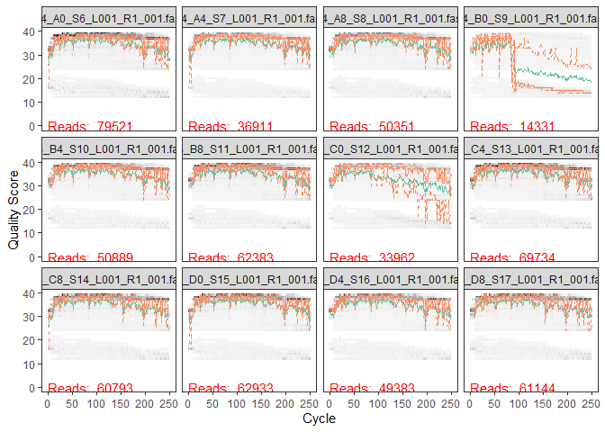
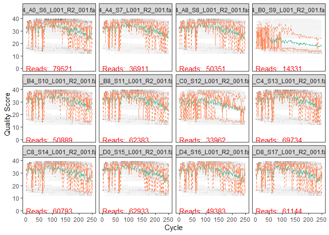
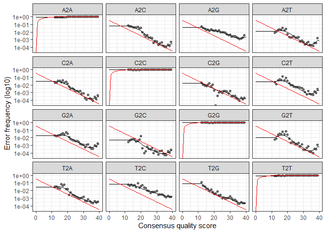
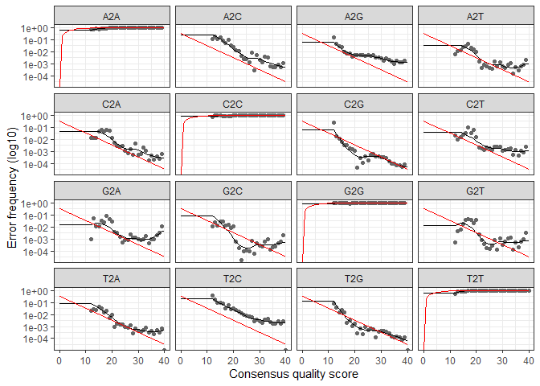

DaDa2 Data Analysis
================
Kai Oda
11/8/2020

## Install the Dada2 Pipline

``` r
# if (!requireNamespace("BiocManager", quietly = TRUE))
#     install.packages("BiocManager")
# BiocManager::install("dada2", version = "3.11")
# BiocManager::install("ShortRead")
# BiocManager::install(version = '3.11')
```

``` r
library(tidyverse)
library(dada2)
library(ShortRead)
```

## Import the data\!

``` r
path <- ("../Input_Data/week5/EEMB144L_2018_fastq/")

#store the names of the forward and rev files as lists
fnFs <- list.files(path, pattern = "_R1_001.fastq", full.names = TRUE)
fnRs <- list.files(path, pattern = "_R2_001.fastq", full.names = TRUE)

fnFs
```

    ##  [1] "../Input_Data/week5/EEMB144L_2018_fastq/144_A0_S6_L001_R1_001.fastq" 
    ##  [2] "../Input_Data/week5/EEMB144L_2018_fastq/144_A4_S7_L001_R1_001.fastq" 
    ##  [3] "../Input_Data/week5/EEMB144L_2018_fastq/144_A8_S8_L001_R1_001.fastq" 
    ##  [4] "../Input_Data/week5/EEMB144L_2018_fastq/144_B0_S9_L001_R1_001.fastq" 
    ##  [5] "../Input_Data/week5/EEMB144L_2018_fastq/144_B4_S10_L001_R1_001.fastq"
    ##  [6] "../Input_Data/week5/EEMB144L_2018_fastq/144_B8_S11_L001_R1_001.fastq"
    ##  [7] "../Input_Data/week5/EEMB144L_2018_fastq/144_C0_S12_L001_R1_001.fastq"
    ##  [8] "../Input_Data/week5/EEMB144L_2018_fastq/144_C4_S13_L001_R1_001.fastq"
    ##  [9] "../Input_Data/week5/EEMB144L_2018_fastq/144_C8_S14_L001_R1_001.fastq"
    ## [10] "../Input_Data/week5/EEMB144L_2018_fastq/144_D0_S15_L001_R1_001.fastq"
    ## [11] "../Input_Data/week5/EEMB144L_2018_fastq/144_D4_S16_L001_R1_001.fastq"
    ## [12] "../Input_Data/week5/EEMB144L_2018_fastq/144_D8_S17_L001_R1_001.fastq"
    ## [13] "../Input_Data/week5/EEMB144L_2018_fastq/144_E0_S18_L001_R1_001.fastq"
    ## [14] "../Input_Data/week5/EEMB144L_2018_fastq/144_E4_S19_L001_R1_001.fastq"
    ## [15] "../Input_Data/week5/EEMB144L_2018_fastq/144_E8_S20_L001_R1_001.fastq"
    ## [16] "../Input_Data/week5/EEMB144L_2018_fastq/144_F0_S21_L001_R1_001.fastq"
    ## [17] "../Input_Data/week5/EEMB144L_2018_fastq/144_F4_S22_L001_R1_001.fastq"
    ## [18] "../Input_Data/week5/EEMB144L_2018_fastq/144_F8_S23_L001_R1_001.fastq"
    ## [19] "../Input_Data/week5/EEMB144L_2018_fastq/144_G0_S24_L001_R1_001.fastq"
    ## [20] "../Input_Data/week5/EEMB144L_2018_fastq/144_G4_S25_L001_R1_001.fastq"
    ## [21] "../Input_Data/week5/EEMB144L_2018_fastq/144_G8_S26_L001_R1_001.fastq"
    ## [22] "../Input_Data/week5/EEMB144L_2018_fastq/144_H0_S27_L001_R1_001.fastq"
    ## [23] "../Input_Data/week5/EEMB144L_2018_fastq/144_H4_S28_L001_R1_001.fastq"
    ## [24] "../Input_Data/week5/EEMB144L_2018_fastq/144_H8_S29_L001_R1_001.fastq"

``` r
fnRs
```

    ##  [1] "../Input_Data/week5/EEMB144L_2018_fastq/144_A0_S6_L001_R2_001.fastq" 
    ##  [2] "../Input_Data/week5/EEMB144L_2018_fastq/144_A4_S7_L001_R2_001.fastq" 
    ##  [3] "../Input_Data/week5/EEMB144L_2018_fastq/144_A8_S8_L001_R2_001.fastq" 
    ##  [4] "../Input_Data/week5/EEMB144L_2018_fastq/144_B0_S9_L001_R2_001.fastq" 
    ##  [5] "../Input_Data/week5/EEMB144L_2018_fastq/144_B4_S10_L001_R2_001.fastq"
    ##  [6] "../Input_Data/week5/EEMB144L_2018_fastq/144_B8_S11_L001_R2_001.fastq"
    ##  [7] "../Input_Data/week5/EEMB144L_2018_fastq/144_C0_S12_L001_R2_001.fastq"
    ##  [8] "../Input_Data/week5/EEMB144L_2018_fastq/144_C4_S13_L001_R2_001.fastq"
    ##  [9] "../Input_Data/week5/EEMB144L_2018_fastq/144_C8_S14_L001_R2_001.fastq"
    ## [10] "../Input_Data/week5/EEMB144L_2018_fastq/144_D0_S15_L001_R2_001.fastq"
    ## [11] "../Input_Data/week5/EEMB144L_2018_fastq/144_D4_S16_L001_R2_001.fastq"
    ## [12] "../Input_Data/week5/EEMB144L_2018_fastq/144_D8_S17_L001_R2_001.fastq"
    ## [13] "../Input_Data/week5/EEMB144L_2018_fastq/144_E0_S18_L001_R2_001.fastq"
    ## [14] "../Input_Data/week5/EEMB144L_2018_fastq/144_E4_S19_L001_R2_001.fastq"
    ## [15] "../Input_Data/week5/EEMB144L_2018_fastq/144_E8_S20_L001_R2_001.fastq"
    ## [16] "../Input_Data/week5/EEMB144L_2018_fastq/144_F0_S21_L001_R2_001.fastq"
    ## [17] "../Input_Data/week5/EEMB144L_2018_fastq/144_F4_S22_L001_R2_001.fastq"
    ## [18] "../Input_Data/week5/EEMB144L_2018_fastq/144_F8_S23_L001_R2_001.fastq"
    ## [19] "../Input_Data/week5/EEMB144L_2018_fastq/144_G0_S24_L001_R2_001.fastq"
    ## [20] "../Input_Data/week5/EEMB144L_2018_fastq/144_G4_S25_L001_R2_001.fastq"
    ## [21] "../Input_Data/week5/EEMB144L_2018_fastq/144_G8_S26_L001_R2_001.fastq"
    ## [22] "../Input_Data/week5/EEMB144L_2018_fastq/144_H0_S27_L001_R2_001.fastq"
    ## [23] "../Input_Data/week5/EEMB144L_2018_fastq/144_H4_S28_L001_R2_001.fastq"
    ## [24] "../Input_Data/week5/EEMB144L_2018_fastq/144_H8_S29_L001_R2_001.fastq"

## Detect and remove primers (if necessary)

  - Forward primer = **514F-Y**
  - Reverse primer = **806RB**

<!-- end list -->

``` r
FWD = "GTGYCAGCMGCCGCGGTAA"
REV = "GGACTACNVGGGTWTCTAAT"

#Now, create a function that generates all possible orientations of the forward and reverse primers 
allOrients <- function(primer) {
  require(Biostrings)
  dna <- DNAString(primer)
  orients <- c(Forward = dna, Complement = complement(dna), Reverse = reverse(dna), 
               RevComp = reverseComplement(dna))
  return(sapply(orients, toString))
}

#Apply the function to the forward adn reverse primers to get the possible orientations
FWD.orients <- allOrients(FWD)
REV.orients <- allOrients(REV)


FWD.orients
```

    ##               Forward            Complement               Reverse 
    ## "GTGYCAGCMGCCGCGGTAA" "CACRGTCGKCGGCGCCATT" "AATGGCGCCGMCGACYGTG" 
    ##               RevComp 
    ## "TTACCGCGGCKGCTGRCAC"

``` r
REV.orients
```

    ##                Forward             Complement                Reverse 
    ## "GGACTACNVGGGTWTCTAAT" "CCTGATGNBCCCAWAGATTA" "TAATCTWTGGGVNCATCAGG" 
    ##                RevComp 
    ## "ATTAGAWACCCBNGTAGTCC"

Now that we have the possible orientations of the primer we want to
search for their occurence in the sequence files and remove the data if
necessary.

``` r
primerHits <- function(primer, fn) {
  # Counts number of reads in which the primer is found
  nhits <- vcountPattern(primer, sread(readFastq(fn)), fixed = FALSE)
  return(sum(nhits > 0))
}

rbind(FWD.ForwardReads = sapply(FWD.orients, primerHits, fn = fnFs[[1]]), 
      FWD.ReverseReads = sapply(FWD.orients, primerHits, fn = fnRs[[1]]), 
      REV.ForwardReads = sapply(REV.orients, primerHits, fn = fnFs[[1]]), 
      REV.ReverseReads = sapply(REV.orients, primerHits, fn = fnRs[[1]]))
```

    ##                  Forward Complement Reverse RevComp
    ## FWD.ForwardReads       0          0       0       0
    ## FWD.ReverseReads       0          0       0     283
    ## REV.ForwardReads       0          0       0    1195
    ## REV.ReverseReads       0          0       0       0

There are a ton of occurences of the reverse complement in the forward
reverse reads and the reverse forward read, but we’re just gonna keep on
forging forward? The video tutorials also had some occurences of the
reverse complement.

## Create quality profiles

Quality profiles allow the user to assess the quality of the reads and
determine if the sequence needs to be run again.

  - Gray scale = Frequency of each quality score @ each base position
  - Green = mean quality score
  - Orange = quartiles for quality score at each base position

<!-- end list -->

``` r
# Generate quality profile for the forward read 
plotQualityProfile(fnFs[1:12])
```

<!-- -->

Like the video tutorials, the quality score seems to be fairly high for
the forward direction. We will follow the tutorial and trim off the last
10 cycles for the forward direction.

``` r
# Generate quality profile for the reverse read 
plotQualityProfile(fnRs[1:12])
```

<!-- -->

The reverse reads are much lower quality when compared to the forward
reads. However, like the tutorial the quality seems to be OK until \~150
cycle. We will trim the data there.

## Filtering and Trimming the Data

Based on our visual inspection of the quality profiles we want to filter
and trim the data. However, first we want to create a separate folder
that contains the trimmed data so that we can leave the original
sequences alone/unaltered.

``` r
# This line gives the names of all the samples of the forward direction (same names as the reverse direction)
sample.names <- sapply(strsplit(basename(fnFs),"_L"), `[`,1)
sample.names
```

    ##  [1] "144_A0_S6"  "144_A4_S7"  "144_A8_S8"  "144_B0_S9"  "144_B4_S10"
    ##  [6] "144_B8_S11" "144_C0_S12" "144_C4_S13" "144_C8_S14" "144_D0_S15"
    ## [11] "144_D4_S16" "144_D8_S17" "144_E0_S18" "144_E4_S19" "144_E8_S20"
    ## [16] "144_F0_S21" "144_F4_S22" "144_F8_S23" "144_G0_S24" "144_G4_S25"
    ## [21] "144_G8_S26" "144_H0_S27" "144_H4_S28" "144_H8_S29"

``` r
## Creates a new folder to put the filtered sequences
filt_path <- file.path(path,"filtered")

#add the appropriate designation string to any new files made that will be put into the "filtered" folder
filtFs <- file.path(filt_path, paste0(sample.names, "_F_filt.fastq"))
filtRs <- file.path(filt_path, paste0(sample.names, "_R_filt.fastq"))
```

``` r
out <- filterAndTrim(fnFs, filtFs, fnRs, filtRs, truncLen = c(240,150),  maxN = 0, maxEE = c(2,2), truncQ = 2, rm.phix = TRUE, compress = TRUE)
out
```

    ##                              reads.in reads.out
    ## 144_A0_S6_L001_R1_001.fastq     79521     67972
    ## 144_A4_S7_L001_R1_001.fastq     36911     32141
    ## 144_A8_S8_L001_R1_001.fastq     50351     43213
    ## 144_B0_S9_L001_R1_001.fastq     14331      3070
    ## 144_B4_S10_L001_R1_001.fastq    50889     43678
    ## 144_B8_S11_L001_R1_001.fastq    62383     53847
    ## 144_C0_S12_L001_R1_001.fastq    33962     24060
    ## 144_C4_S13_L001_R1_001.fastq    69734     60423
    ## 144_C8_S14_L001_R1_001.fastq    60793     52969
    ## 144_D0_S15_L001_R1_001.fastq    62933     56012
    ## 144_D4_S16_L001_R1_001.fastq    49383     43001
    ## 144_D8_S17_L001_R1_001.fastq    61144     52929
    ## 144_E0_S18_L001_R1_001.fastq    53714     47453
    ## 144_E4_S19_L001_R1_001.fastq    41686     35888
    ## 144_E8_S20_L001_R1_001.fastq    34947     29277
    ## 144_F0_S21_L001_R1_001.fastq    54554     48269
    ## 144_F4_S22_L001_R1_001.fastq    32800     28766
    ## 144_F8_S23_L001_R1_001.fastq    33312     30014
    ## 144_G0_S24_L001_R1_001.fastq    40935     36168
    ## 144_G4_S25_L001_R1_001.fastq    40109     35236
    ## 144_G8_S26_L001_R1_001.fastq    35610     31788
    ## 144_H0_S27_L001_R1_001.fastq    63711     57388
    ## 144_H4_S28_L001_R1_001.fastq    27892     24291
    ## 144_H8_S29_L001_R1_001.fastq    36860     32338

We now have a filtered dataset\!

## Generating the error model and plotting the results

``` r
errF <- learnErrors(filtFs, multithread = TRUE)
```

    ## 104972400 total bases in 437385 reads from 10 samples will be used for learning the error rates.

``` r
errR <- learnErrors(filtRs, multithread = TRUE)
```

    ## 104130300 total bases in 694202 reads from 16 samples will be used for learning the error rates.

The error plot elements are as follows:

  - X axis = quality score (Based on quality profiles)
  - Y axis = error frequency
  - Error rates between each possible transition
  - Points = observed error rates
  - Black line = Estimated error rates
  - Red line = Error rates expected via quality score

TLDR: Error rates drop with increasing quality score

``` r
plotErrors(errF, nominalQ = TRUE)
```

    ## Warning: Transformation introduced infinite values in continuous y-axis
    
    ## Warning: Transformation introduced infinite values in continuous y-axis

<!-- -->

``` r
plotErrors(errR, nominalQ = TRUE)
```

    ## Warning: Transformation introduced infinite values in continuous y-axis
    
    ## Warning: Transformation introduced infinite values in continuous y-axis

<!-- -->

## Removing replication in filtered sequence data

``` r
# Making use of Dada2s derepFastq() function 
derepFs <- derepFastq(filtFs, verbose = TRUE)
```

    ## Dereplicating sequence entries in Fastq file: ../Input_Data/week5/EEMB144L_2018_fastq//filtered/144_A0_S6_F_filt.fastq

    ## Encountered 18932 unique sequences from 67972 total sequences read.

    ## Dereplicating sequence entries in Fastq file: ../Input_Data/week5/EEMB144L_2018_fastq//filtered/144_A4_S7_F_filt.fastq

    ## Encountered 9208 unique sequences from 32141 total sequences read.

    ## Dereplicating sequence entries in Fastq file: ../Input_Data/week5/EEMB144L_2018_fastq//filtered/144_A8_S8_F_filt.fastq

    ## Encountered 12497 unique sequences from 43213 total sequences read.

    ## Dereplicating sequence entries in Fastq file: ../Input_Data/week5/EEMB144L_2018_fastq//filtered/144_B0_S9_F_filt.fastq

    ## Encountered 1382 unique sequences from 3070 total sequences read.

    ## Dereplicating sequence entries in Fastq file: ../Input_Data/week5/EEMB144L_2018_fastq//filtered/144_B4_S10_F_filt.fastq

    ## Encountered 11805 unique sequences from 43678 total sequences read.

    ## Dereplicating sequence entries in Fastq file: ../Input_Data/week5/EEMB144L_2018_fastq//filtered/144_B8_S11_F_filt.fastq

    ## Encountered 14833 unique sequences from 53847 total sequences read.

    ## Dereplicating sequence entries in Fastq file: ../Input_Data/week5/EEMB144L_2018_fastq//filtered/144_C0_S12_F_filt.fastq

    ## Encountered 7856 unique sequences from 24060 total sequences read.

    ## Dereplicating sequence entries in Fastq file: ../Input_Data/week5/EEMB144L_2018_fastq//filtered/144_C4_S13_F_filt.fastq

    ## Encountered 13719 unique sequences from 60423 total sequences read.

    ## Dereplicating sequence entries in Fastq file: ../Input_Data/week5/EEMB144L_2018_fastq//filtered/144_C8_S14_F_filt.fastq

    ## Encountered 14168 unique sequences from 52969 total sequences read.

    ## Dereplicating sequence entries in Fastq file: ../Input_Data/week5/EEMB144L_2018_fastq//filtered/144_D0_S15_F_filt.fastq

    ## Encountered 15521 unique sequences from 56012 total sequences read.

    ## Dereplicating sequence entries in Fastq file: ../Input_Data/week5/EEMB144L_2018_fastq//filtered/144_D4_S16_F_filt.fastq

    ## Encountered 9469 unique sequences from 43001 total sequences read.

    ## Dereplicating sequence entries in Fastq file: ../Input_Data/week5/EEMB144L_2018_fastq//filtered/144_D8_S17_F_filt.fastq

    ## Encountered 14768 unique sequences from 52929 total sequences read.

    ## Dereplicating sequence entries in Fastq file: ../Input_Data/week5/EEMB144L_2018_fastq//filtered/144_E0_S18_F_filt.fastq

    ## Encountered 13712 unique sequences from 47453 total sequences read.

    ## Dereplicating sequence entries in Fastq file: ../Input_Data/week5/EEMB144L_2018_fastq//filtered/144_E4_S19_F_filt.fastq

    ## Encountered 9521 unique sequences from 35888 total sequences read.

    ## Dereplicating sequence entries in Fastq file: ../Input_Data/week5/EEMB144L_2018_fastq//filtered/144_E8_S20_F_filt.fastq

    ## Encountered 8628 unique sequences from 29277 total sequences read.

    ## Dereplicating sequence entries in Fastq file: ../Input_Data/week5/EEMB144L_2018_fastq//filtered/144_F0_S21_F_filt.fastq

    ## Encountered 14157 unique sequences from 48269 total sequences read.

    ## Dereplicating sequence entries in Fastq file: ../Input_Data/week5/EEMB144L_2018_fastq//filtered/144_F4_S22_F_filt.fastq

    ## Encountered 8088 unique sequences from 28766 total sequences read.

    ## Dereplicating sequence entries in Fastq file: ../Input_Data/week5/EEMB144L_2018_fastq//filtered/144_F8_S23_F_filt.fastq

    ## Encountered 8155 unique sequences from 30014 total sequences read.

    ## Dereplicating sequence entries in Fastq file: ../Input_Data/week5/EEMB144L_2018_fastq//filtered/144_G0_S24_F_filt.fastq

    ## Encountered 10822 unique sequences from 36168 total sequences read.

    ## Dereplicating sequence entries in Fastq file: ../Input_Data/week5/EEMB144L_2018_fastq//filtered/144_G4_S25_F_filt.fastq

    ## Encountered 8483 unique sequences from 35236 total sequences read.

    ## Dereplicating sequence entries in Fastq file: ../Input_Data/week5/EEMB144L_2018_fastq//filtered/144_G8_S26_F_filt.fastq

    ## Encountered 8503 unique sequences from 31788 total sequences read.

    ## Dereplicating sequence entries in Fastq file: ../Input_Data/week5/EEMB144L_2018_fastq//filtered/144_H0_S27_F_filt.fastq

    ## Encountered 15044 unique sequences from 57388 total sequences read.

    ## Dereplicating sequence entries in Fastq file: ../Input_Data/week5/EEMB144L_2018_fastq//filtered/144_H4_S28_F_filt.fastq

    ## Encountered 5919 unique sequences from 24291 total sequences read.

    ## Dereplicating sequence entries in Fastq file: ../Input_Data/week5/EEMB144L_2018_fastq//filtered/144_H8_S29_F_filt.fastq

    ## Encountered 9702 unique sequences from 32338 total sequences read.

``` r
derepRs <- derepFastq(filtRs, verbose = TRUE)
```

    ## Dereplicating sequence entries in Fastq file: ../Input_Data/week5/EEMB144L_2018_fastq//filtered/144_A0_S6_R_filt.fastq

    ## Encountered 22356 unique sequences from 67972 total sequences read.

    ## Dereplicating sequence entries in Fastq file: ../Input_Data/week5/EEMB144L_2018_fastq//filtered/144_A4_S7_R_filt.fastq

    ## Encountered 10600 unique sequences from 32141 total sequences read.

    ## Dereplicating sequence entries in Fastq file: ../Input_Data/week5/EEMB144L_2018_fastq//filtered/144_A8_S8_R_filt.fastq

    ## Encountered 15296 unique sequences from 43213 total sequences read.

    ## Dereplicating sequence entries in Fastq file: ../Input_Data/week5/EEMB144L_2018_fastq//filtered/144_B0_S9_R_filt.fastq

    ## Encountered 1593 unique sequences from 3070 total sequences read.

    ## Dereplicating sequence entries in Fastq file: ../Input_Data/week5/EEMB144L_2018_fastq//filtered/144_B4_S10_R_filt.fastq

    ## Encountered 14378 unique sequences from 43678 total sequences read.

    ## Dereplicating sequence entries in Fastq file: ../Input_Data/week5/EEMB144L_2018_fastq//filtered/144_B8_S11_R_filt.fastq

    ## Encountered 19110 unique sequences from 53847 total sequences read.

    ## Dereplicating sequence entries in Fastq file: ../Input_Data/week5/EEMB144L_2018_fastq//filtered/144_C0_S12_R_filt.fastq

    ## Encountered 11295 unique sequences from 24060 total sequences read.

    ## Dereplicating sequence entries in Fastq file: ../Input_Data/week5/EEMB144L_2018_fastq//filtered/144_C4_S13_R_filt.fastq

    ## Encountered 17845 unique sequences from 60423 total sequences read.

    ## Dereplicating sequence entries in Fastq file: ../Input_Data/week5/EEMB144L_2018_fastq//filtered/144_C8_S14_R_filt.fastq

    ## Encountered 17700 unique sequences from 52969 total sequences read.

    ## Dereplicating sequence entries in Fastq file: ../Input_Data/week5/EEMB144L_2018_fastq//filtered/144_D0_S15_R_filt.fastq

    ## Encountered 19854 unique sequences from 56012 total sequences read.

    ## Dereplicating sequence entries in Fastq file: ../Input_Data/week5/EEMB144L_2018_fastq//filtered/144_D4_S16_R_filt.fastq

    ## Encountered 13776 unique sequences from 43001 total sequences read.

    ## Dereplicating sequence entries in Fastq file: ../Input_Data/week5/EEMB144L_2018_fastq//filtered/144_D8_S17_R_filt.fastq

    ## Encountered 19687 unique sequences from 52929 total sequences read.

    ## Dereplicating sequence entries in Fastq file: ../Input_Data/week5/EEMB144L_2018_fastq//filtered/144_E0_S18_R_filt.fastq

    ## Encountered 17696 unique sequences from 47453 total sequences read.

    ## Dereplicating sequence entries in Fastq file: ../Input_Data/week5/EEMB144L_2018_fastq//filtered/144_E4_S19_R_filt.fastq

    ## Encountered 13559 unique sequences from 35888 total sequences read.

    ## Dereplicating sequence entries in Fastq file: ../Input_Data/week5/EEMB144L_2018_fastq//filtered/144_E8_S20_R_filt.fastq

    ## Encountered 14855 unique sequences from 29277 total sequences read.

    ## Dereplicating sequence entries in Fastq file: ../Input_Data/week5/EEMB144L_2018_fastq//filtered/144_F0_S21_R_filt.fastq

    ## Encountered 18646 unique sequences from 48269 total sequences read.

    ## Dereplicating sequence entries in Fastq file: ../Input_Data/week5/EEMB144L_2018_fastq//filtered/144_F4_S22_R_filt.fastq

    ## Encountered 9704 unique sequences from 28766 total sequences read.

    ## Dereplicating sequence entries in Fastq file: ../Input_Data/week5/EEMB144L_2018_fastq//filtered/144_F8_S23_R_filt.fastq

    ## Encountered 9645 unique sequences from 30014 total sequences read.

    ## Dereplicating sequence entries in Fastq file: ../Input_Data/week5/EEMB144L_2018_fastq//filtered/144_G0_S24_R_filt.fastq

    ## Encountered 13092 unique sequences from 36168 total sequences read.

    ## Dereplicating sequence entries in Fastq file: ../Input_Data/week5/EEMB144L_2018_fastq//filtered/144_G4_S25_R_filt.fastq

    ## Encountered 11615 unique sequences from 35236 total sequences read.

    ## Dereplicating sequence entries in Fastq file: ../Input_Data/week5/EEMB144L_2018_fastq//filtered/144_G8_S26_R_filt.fastq

    ## Encountered 10202 unique sequences from 31788 total sequences read.

    ## Dereplicating sequence entries in Fastq file: ../Input_Data/week5/EEMB144L_2018_fastq//filtered/144_H0_S27_R_filt.fastq

    ## Encountered 19510 unique sequences from 57388 total sequences read.

    ## Dereplicating sequence entries in Fastq file: ../Input_Data/week5/EEMB144L_2018_fastq//filtered/144_H4_S28_R_filt.fastq

    ## Encountered 9788 unique sequences from 24291 total sequences read.

    ## Dereplicating sequence entries in Fastq file: ../Input_Data/week5/EEMB144L_2018_fastq//filtered/144_H8_S29_R_filt.fastq

    ## Encountered 11301 unique sequences from 32338 total sequences read.

``` r
## Assign sample names to the filtered list of sequences 
names(derepFs) <- sample.names
names(derepRs) <- sample.names
```

## Infer sequence variants

We’re bringing it all together now. Essentially, we want to create a
merged dataset of the forward and reverse reads that minimizes error and
overlap. This dataset will have the number of unique sequences as well
as information on average sequence lengths.

``` r
## Applies error model to the entire dataset to remove sequences that are likely not real
dadaFs <- dada(derepFs, err = errF, multithread = TRUE)
```

    ## Sample 1 - 67972 reads in 18932 unique sequences.
    ## Sample 2 - 32141 reads in 9208 unique sequences.
    ## Sample 3 - 43213 reads in 12497 unique sequences.
    ## Sample 4 - 3070 reads in 1382 unique sequences.
    ## Sample 5 - 43678 reads in 11805 unique sequences.
    ## Sample 6 - 53847 reads in 14833 unique sequences.
    ## Sample 7 - 24060 reads in 7856 unique sequences.
    ## Sample 8 - 60423 reads in 13719 unique sequences.
    ## Sample 9 - 52969 reads in 14168 unique sequences.
    ## Sample 10 - 56012 reads in 15521 unique sequences.
    ## Sample 11 - 43001 reads in 9469 unique sequences.
    ## Sample 12 - 52929 reads in 14768 unique sequences.
    ## Sample 13 - 47453 reads in 13712 unique sequences.
    ## Sample 14 - 35888 reads in 9521 unique sequences.
    ## Sample 15 - 29277 reads in 8628 unique sequences.
    ## Sample 16 - 48269 reads in 14157 unique sequences.
    ## Sample 17 - 28766 reads in 8088 unique sequences.
    ## Sample 18 - 30014 reads in 8155 unique sequences.
    ## Sample 19 - 36168 reads in 10822 unique sequences.
    ## Sample 20 - 35236 reads in 8483 unique sequences.
    ## Sample 21 - 31788 reads in 8503 unique sequences.
    ## Sample 22 - 57388 reads in 15044 unique sequences.
    ## Sample 23 - 24291 reads in 5919 unique sequences.
    ## Sample 24 - 32338 reads in 9702 unique sequences.

``` r
dadaRs <- dada(derepRs, err = errR, multithread = TRUE)
```

    ## Sample 1 - 67972 reads in 22356 unique sequences.
    ## Sample 2 - 32141 reads in 10600 unique sequences.
    ## Sample 3 - 43213 reads in 15296 unique sequences.
    ## Sample 4 - 3070 reads in 1593 unique sequences.
    ## Sample 5 - 43678 reads in 14378 unique sequences.
    ## Sample 6 - 53847 reads in 19110 unique sequences.
    ## Sample 7 - 24060 reads in 11295 unique sequences.
    ## Sample 8 - 60423 reads in 17845 unique sequences.
    ## Sample 9 - 52969 reads in 17700 unique sequences.
    ## Sample 10 - 56012 reads in 19854 unique sequences.
    ## Sample 11 - 43001 reads in 13776 unique sequences.
    ## Sample 12 - 52929 reads in 19687 unique sequences.
    ## Sample 13 - 47453 reads in 17696 unique sequences.
    ## Sample 14 - 35888 reads in 13559 unique sequences.
    ## Sample 15 - 29277 reads in 14855 unique sequences.
    ## Sample 16 - 48269 reads in 18646 unique sequences.
    ## Sample 17 - 28766 reads in 9704 unique sequences.
    ## Sample 18 - 30014 reads in 9645 unique sequences.
    ## Sample 19 - 36168 reads in 13092 unique sequences.
    ## Sample 20 - 35236 reads in 11615 unique sequences.
    ## Sample 21 - 31788 reads in 10202 unique sequences.
    ## Sample 22 - 57388 reads in 19510 unique sequences.
    ## Sample 23 - 24291 reads in 9788 unique sequences.
    ## Sample 24 - 32338 reads in 11301 unique sequences.

Next, we want to merge the forward and reverse datasets. This supposedly
reduces error by reducing the amount of overlap between the datasets. We
can also remove issues that we noticed with the reverse complement
primer earlier in this tutorial with the *trimOverhang = T* argument.
Supposedly, the reverse read often extends past the forward read,
resulting in issues when we look at the reverse complement primer. This
command trims that extension.

``` r
mergers <- mergePairs(dadaFs, derepFs, dadaRs, derepRs, verbose = TRUE, trimOverhang = T)
```

    ## 57725 paired-reads (in 283 unique pairings) successfully merged out of 67213 (in 803 pairings) input.

    ## 28832 paired-reads (in 153 unique pairings) successfully merged out of 31610 (in 412 pairings) input.

    ## 37442 paired-reads (in 192 unique pairings) successfully merged out of 42526 (in 521 pairings) input.

    ## 2394 paired-reads (in 65 unique pairings) successfully merged out of 2851 (in 152 pairings) input.

    ## 38302 paired-reads (in 165 unique pairings) successfully merged out of 42994 (in 464 pairings) input.

    ## 46571 paired-reads (in 214 unique pairings) successfully merged out of 53253 (in 614 pairings) input.

    ## 20492 paired-reads (in 184 unique pairings) successfully merged out of 23589 (in 454 pairings) input.

    ## 56568 paired-reads (in 153 unique pairings) successfully merged out of 59785 (in 445 pairings) input.

    ## 50139 paired-reads (in 211 unique pairings) successfully merged out of 52469 (in 516 pairings) input.

    ## 48577 paired-reads (in 263 unique pairings) successfully merged out of 55347 (in 637 pairings) input.

    ## 41080 paired-reads (in 118 unique pairings) successfully merged out of 42574 (in 311 pairings) input.

    ## 49836 paired-reads (in 210 unique pairings) successfully merged out of 52449 (in 511 pairings) input.

    ## 41193 paired-reads (in 227 unique pairings) successfully merged out of 46790 (in 555 pairings) input.

    ## 33136 paired-reads (in 149 unique pairings) successfully merged out of 35471 (in 369 pairings) input.

    ## 26263 paired-reads (in 146 unique pairings) successfully merged out of 28702 (in 477 pairings) input.

    ## 38870 paired-reads (in 215 unique pairings) successfully merged out of 47485 (in 605 pairings) input.

    ## 26000 paired-reads (in 125 unique pairings) successfully merged out of 28458 (in 272 pairings) input.

    ## 27284 paired-reads (in 171 unique pairings) successfully merged out of 29636 (in 335 pairings) input.

    ## 29960 paired-reads (in 191 unique pairings) successfully merged out of 35569 (in 402 pairings) input.

    ## 32815 paired-reads (in 126 unique pairings) successfully merged out of 34805 (in 339 pairings) input.

    ## 28824 paired-reads (in 141 unique pairings) successfully merged out of 31390 (in 297 pairings) input.

    ## 40607 paired-reads (in 243 unique pairings) successfully merged out of 56564 (in 596 pairings) input.

    ## 22824 paired-reads (in 109 unique pairings) successfully merged out of 23936 (in 268 pairings) input.

    ## 28250 paired-reads (in 148 unique pairings) successfully merged out of 31963 (in 304 pairings) input.

Let’s look at the first six rows of the first element in the merged
datset.

  - forward /reverse index = Location
  - nMatch = \# of overlaps for forward and reverse direction

<!-- end list -->

``` r
head(mergers[[1]])
```

    ##                                                                                                                                                                                                                                                        sequence
    ## 1 TACGGAGGGTGCAAGCGTTACTCGGAATCACTGGGCGTAAAGAGCGTGTAGGCGGATAGTTAAGTTTGAAGTGAAATCCTATGGCTCAACCATAGAACTGCTTTGAAAACTGATTATCTAGAATATGGGAGAGGTAGATGGAATTTCTGGTGTAGGGGTAAAATCCGTAGAGATCAGAAGGAATACCGATTGCGAAGGCGATCTACTGGAACATTATTGACGCTGAGACGCGAAAGCGTGGGGAGCAAACAGG
    ## 2 TACGGAGGGTCCGAGCGTTAATCGGAATTACTGGGCGTAAAGCGCGCGTAGGTGGTTTTGTCAGTCAGATGTGAAAGCCCAGGGCTCAACCTTGGAACTGCACCTGATACTGCAAGACTAGAGTACAATAGAGGGGAGTGGAATTTCCGGTGTAGCGGTGAAATGCGTAGAGATCGGAAGGAACACCAGTGGCGAAGGCGACTCCCTGGATTGATACTGACACTGAGGTGCGAAAGCGTGGGGAGCAAACAGG
    ## 3 TACGAAGGGACCTAGCGTAGTTCGGAATTACTGGGCTTAAAGAGTTCGTAGGTGGTTGAAAAAGTTAGTGGTGAAATCCCAGAGCTTAACTCTGGAACTGCCATTAAAACTTTTCAGCTAGAGTATGATAGAGGAAAGCAGAATTTCTAGTGTAGAGGTGAAATTCGTAGATATTAGAAAGAATACCAATTGCGAAGGCAGCTTTCTGGATCATTACTGACACTGAGGAACGAAAGCATGGGTAGCGAAGAGG
    ## 4 TACGGAAGGTGCAAGCGTTAATCGGAATTACTGGGCGTAAAGCGCGCGTAGGTGGTTTGTTAAGTTGGATGTGAAAGCCCTGGGCTCAACCTAGGAACTGCATCCAAAACTAACTCACTAGAGTACGATAGAGGGAGGTAGAATTCATAGTGTAGCGGTGGAATGCGTAGATATTATGAAGAATACCAGTGGCGAAGGCGGCCTCCTGGATCTGTACTGACACTGAGGTGCGAAAGCGTGGGTAGCGAACAGG
    ## 6 TACGGGAGTGGCAAGCGTTATCCGGAATTATTGGGCGTAAAGCGTCCGCAGGCGGCCCTTCAAGTCTGCTGTTAAAAAGTGGAGCTTAACTCCATCATGGCAGTGGAAACTGAGGGGCTTGAGTGTGGTAGGGGCAGAGGGAATTCCCGGTGTAGCGGTGAAATGCGTAGATATCGGGAAGAACACCAGTGGCGAAGGCGCTCTGCTGGGCCATCACTGACGCTCATGGACGAAAGCCAGGGGAGCGAAAGGG
    ## 7 TACGGAAGGTCCAAGCGTTAATCGGAATTACTGGGCGTAAAGCGCGCGTAGGTGGTTTATTAAGTTGGATGTGAAATCCCCGGGCTCAACCTGGGAACTGCATCCAAAACTGATTCACTAGAGTACGATAGAGGGAGGTAGAATTCACAGTGTAGCGGTGGAATGCGTAGATATTGTGAAGAATACCAATGGCGAAGGCAGCCTCCTGGATCTGTACTGACACTGAGGTGCGAAAGCGTGGGTAGCGAACAGG
    ##   abundance forward reverse nmatch nmismatch nindel prefer accept
    ## 1      3642       2       1    137         0      0      1   TRUE
    ## 2      3613       3       3    137         0      0      1   TRUE
    ## 3      3021       1       2    137         0      0      1   TRUE
    ## 4      3019       4       4    137         0      0      1   TRUE
    ## 6      2251       5       6    137         0      0      1   TRUE
    ## 7      1870       6       9    137         0      0      1   TRUE

Then, we save the merged dataset for use in future assignments.

``` r
saveRDS(mergers, 'dada_merged.RDS')
```

Construct a sequence table:

``` r
seqtab <- makeSequenceTable(mergers)

# Look at the dimensions of the table
dim(seqtab)
```

    ## [1]  24 815

*Note: The columns represent unique sequences.* There are 815 unique
sequences in the amplicon library

Checking the distribution of sequence lengths

``` r
table(nchar(getSequences(seqtab))) 
```

    ## 
    ## 252 253 254 255 256 257 258 265 266 270 373 
    ##  21 739  39   2   4   1   3   1   1   3   1

The first row is the sequence lengths. The second row is the number of
occureneces of the lengths. We can see that most sequences are around
253 base pairs long with some distribution on either side.

## Removing chimeras

It is helpful to start off with a definition of what chimeras actually
are:

Chimeras = Biological sequences that attach to each other. Results in
amplification of non-biological sequence.

TLDR: We want to remove chimeras from the dataset.

``` r
seqtab.nochim <- removeBimeraDenovo(seqtab, verbose = TRUE)
```

    ## Identified 47 bimeras out of 815 input sequences.

``` r
dim(seqtab.nochim)
```

    ## [1]  24 768

``` r
## Check to see what proportion of the dataset was comprised of chimeras 
sum(seqtab.nochim)/sum(seqtab)
```

    ## [1] 0.9951978

So \~ 0.5% of the dataset was comprised of chimeric sequences.

## Assigning taxonomy based on a reference database

Almost done… We now want to assign the unique sequences in our database
to taxonomic groupings in a reference database.

``` r
taxa <- assignTaxonomy(seqtab.nochim, "../Input_Data/week5/Reference_Database/silva_nr_v138_train_set.fa", multithread = TRUE)
```

And… we want to save our datasets for future use\!

*Note: Took \~5 minutes to assign taxonomy on my computer*

``` r
saveRDS(t(seqtab.nochim), "seqtab-nochimtaxa.rds")
saveRDS(taxa,"taxa.rds")
```

And somehow my computer managed to not explode while attempting to run
through these giant dataframes.

*End*
