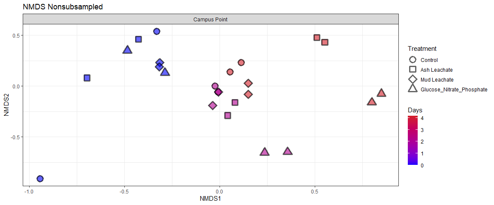

Phyloseq Analysis
================
Kai Oda
11/12/2020

``` r
# BiocManager::install("phyloseq")
```

## Load in the necessary libraries

``` r
library(tidyverse)
library(phyloseq)
library(RColorBrewer)
```

## Import Data from weeks 4 and 5

``` r
count.tab <- read_rds("../DaDa2/seqtab-nochimtaxa.rds") 
tax.tab <- read_rds("../DaDa2/taxa.rds") 
sample.tab <- read_rds("../Bacterial_Abundance/bacterialCarbon.RDS") %>% 
  drop_na(DNA_SampleID) %>% 
  column_to_rownames(var = "DNA_SampleID") 
```

## Create a phyloseq object

Essentially, all we are doing is combining the three datasets together

``` r
OTU = otu_table(count.tab, taxa_are_rows = TRUE) 
TAX = tax_table(tax.tab)
SAM = sample_data(sample.tab)
ps = phyloseq(OTU,TAX,SAM) 
```

## Filtering out chloroplasts and mitochondria

We only want bacteria in our phyloseq object, so let’s remove
chloroplast and mitochondria taxa with the subset\_taxa() command

``` r
sub_ps <- ps %>%
  subset_taxa(Family  != "mitochondria" & Order  != "Chloroplast")
```

## Plotting distribution of read lengths

``` r
sample_sum_df <- data.frame(sum = sample_sums(sub_ps))

ggplot(sample_sum_df, aes(x=sum))+
  geom_histogram(color="black", fill="white", binwidth = 5000)+
  xlab("Read counts")+
  ylab("Occurences")+
  ggtitle("Distribution of sample sequencing depth")+
  theme_bw()
```

<!-- -->

From the histogram we can see that read counts are more or less normally
distributed with a mean \~28000. However, there are some outliers on
either side. The disparity between the smallest read count and the
median may pose some issues when calculating beta diversity.

``` r
## Outputs mean, min and max of the read counts from the dataframe
summary(sample_sum_df)
```

    ##       sum       
    ##  Min.   : 2064  
    ##  1st Qu.:23420  
    ##  Median :28835  
    ##  Mean   :28809  
    ##  3rd Qu.:33571  
    ##  Max.   :53948

One thing to note from this output: the mean read length is
SIGNIFICANTLY larger than the minimum read length (different from the
videos).

This means that when we rarefy the data there will be a massive effect
due to subsampling. Essentially, we are taking a dataset that has an
average of 28000+ in read length, and only randomly sampling 2064
sequences from it. This seems like a LOT of lost data but we push on.

## Rarefying the data

As I understand from the video series:

  - In order to calculate beta diversity we need to calculate pairwise
    comparisons between the data
  - Pairwise comparisons are influenced by read depth
  - Therefore, it is best practice to normalize/standardize read depth
    across samples
  - This standardization process is called “rarefying” data
  - Essentially, we scale to the smallest library size and sub sample
    all sequences until we have a library equal to the smallest size…

<!-- end list -->

``` r
ps_min <-  rarefy_even_depth(sub_ps, sample.size = min(sample_sums(sub_ps)))
```

    ## You set `rngseed` to FALSE. Make sure you've set & recorded
    ##  the random seed of your session for reproducibility.
    ## See `?set.seed`

    ## ...

    ## 140OTUs were removed because they are no longer 
    ## present in any sample after random subsampling

    ## ...

``` r
mean(sample_sums(sub_ps))#28808.5
```

    ## [1] 28808.5

``` r
mean(sample_sums(ps_min)) #2064 
```

    ## [1] 2064

## Ordinating and visualizing beta diversity

``` r
## Calculating the stress level for the non-subsampled datset 
set.seed(1)
nmds <- ordinate(sub_ps, method = "NMDS",  distance = "bray") 
```

    ## Square root transformation
    ## Wisconsin double standardization
    ## Run 0 stress 0.07478252 
    ## Run 1 stress 0.07737625 
    ## Run 2 stress 0.15681 
    ## Run 3 stress 0.07497276 
    ## ... Procrustes: rmse 0.005616706  max resid 0.02034819 
    ## Run 4 stress 0.08305166 
    ## Run 5 stress 0.07594774 
    ## Run 6 stress 0.07563811 
    ## Run 7 stress 0.1625683 
    ## Run 8 stress 0.07768767 
    ## Run 9 stress 0.1639005 
    ## Run 10 stress 0.07563811 
    ## Run 11 stress 0.1189943 
    ## Run 12 stress 0.07478232 
    ## ... New best solution
    ## ... Procrustes: rmse 0.0001755016  max resid 0.0006976295 
    ## ... Similar to previous best
    ## Run 13 stress 0.1685886 
    ## Run 14 stress 0.08452349 
    ## Run 15 stress 0.07768767 
    ## Run 16 stress 0.07563811 
    ## Run 17 stress 0.1767327 
    ## Run 18 stress 0.1588891 
    ## Run 19 stress 0.08294498 
    ## Run 20 stress 0.07563814 
    ## *** Solution reached

Stress level for the **nonsubsampled dataset is 0.076.** This is lower
than the cutoff (0.2). Therefore, this is a reasonably good translation
of multi-dimensional data to a 2D space.

``` r
set.seed(1)
nmds_min <- ordinate(ps_min, method = "NMDS",  distance = "bray") 
```

    ## Square root transformation
    ## Wisconsin double standardization
    ## Run 0 stress 0.08546356 
    ## Run 1 stress 0.1581085 
    ## Run 2 stress 0.1794081 
    ## Run 3 stress 0.08546359 
    ## ... Procrustes: rmse 8.724855e-05  max resid 0.0003514087 
    ## ... Similar to previous best
    ## Run 4 stress 0.08593999 
    ## ... Procrustes: rmse 0.007042164  max resid 0.0256854 
    ## Run 5 stress 0.1664009 
    ## Run 6 stress 0.08593999 
    ## ... Procrustes: rmse 0.007041506  max resid 0.02568023 
    ## Run 7 stress 0.1824937 
    ## Run 8 stress 0.09200391 
    ## Run 9 stress 0.18202 
    ## Run 10 stress 0.243354 
    ## Run 11 stress 0.1363837 
    ## Run 12 stress 0.08546355 
    ## ... New best solution
    ## ... Procrustes: rmse 3.001978e-05  max resid 0.0001201465 
    ## ... Similar to previous best
    ## Run 13 stress 0.08593999 
    ## ... Procrustes: rmse 0.00704506  max resid 0.0256915 
    ## Run 14 stress 0.08546356 
    ## ... Procrustes: rmse 3.289913e-05  max resid 0.000132689 
    ## ... Similar to previous best
    ## Run 15 stress 0.08546355 
    ## ... Procrustes: rmse 2.990219e-06  max resid 7.042775e-06 
    ## ... Similar to previous best
    ## Run 16 stress 0.08772374 
    ## Run 17 stress 0.1812255 
    ## Run 18 stress 0.08546355 
    ## ... New best solution
    ## ... Procrustes: rmse 5.048373e-06  max resid 1.744106e-05 
    ## ... Similar to previous best
    ## Run 19 stress 0.08594001 
    ## ... Procrustes: rmse 0.007028259  max resid 0.02561887 
    ## Run 20 stress 0.08594 
    ## ... Procrustes: rmse 0.007043786  max resid 0.02568649 
    ## *** Solution reached

Stress level for the subsampled dataset is **0.08**. This means that the
subsampled datset is also a good translation from multi-dimensional data
to 2D space.

## Plotting beta diversity

``` r
levels <- c("Control", "Ash Leachate", "Mud Leachate", "Glucose_Nitrate_Phosphate")

nmds.plot <- plot_ordination(sub_ps, nmds, title="NMDS Nonsubsampled")+
  geom_point(aes(fill=days, shape = factor(Treatment, levels = levels)), alpha = 0.6, stroke = 2, size = 4)+
  scale_shape_manual(values = c(21, 22, 23, 24))+
  scale_fill_gradient(low = "blue", high = "#d31f2a")+
  theme_bw()

#remove the point layer (removes the point within the point)
nmds.plot$layers <- nmds.plot$layers[-1]

nmds.plot + 
  facet_grid(~Location)+
  guides(fill = guide_colorbar(title="Days"), shape= guide_legend(title="Treatment"))
```

<!-- -->

Clustered points indicate similar diversity while distance points
indicate relative disimilarity. In early timepoints all treatments are
relatively similar. However, in later treatments the diversity diverges,
with GNP and ash leachate treatments having distinct diversity. Control
and mud leachate treatments appear to have similar diversity.

``` r
nmds_min.plot <- plot_ordination(ps_min, nmds_min, title="NMDS Subsampled")+
  geom_point(aes(fill=days, shape = factor(Treatment, levels = levels)), alpha = 0.6, stroke = 2, size = 4)+
  scale_shape_manual(values = c(21, 22, 23, 24))+
  scale_fill_gradient(low = "blue", high = "#d31f2a")+
  theme_bw()

#remove the point layer (removes the point within the point)
nmds_min.plot$layers <- nmds_min.plot$layers[-1]

nmds_min.plot + 
  facet_grid(~Location)+
  guides(fill = guide_colorbar(title="Days"), shape= guide_legend(title="Treatment"))
```

<!-- -->

The subsampled beta diversity plot has similar trends to the
nonsubsampled one.

## Calculating and plotting alpha diversity

We will be using two different calculations of alpha diversity: Chao1
and Shannon index

  - The Chao1 measure computes species richness
  - The Shannon index computers species richness **and** eveness

<!-- end list -->

``` r
## Calculate alpha diversity measures 
richness <- estimate_richness(ps_min, measures = c("Chao1", "Shannon"))

## Create a column that contains the name of the rows
richness <- richness %>% 
  rownames_to_column(., var = "DNA_ID") %>% 
  mutate_at(vars(DNA_ID), str_replace_all, pattern = "X144", "144") 
## Using the mutate_at() function to replace X144 strings with 144 so that we can combine the metadata and richness estimates 
```

``` r
# Join the alpha diversity measures to the metadata 
alphadiv <- left_join(richness, sample.tab %>% rownames_to_column(., var = "DNA_ID")) 
```

    ## Joining, by = "DNA_ID"

In the next step we want to use the pivot\_longer() function to combine
the alpha diversity measures into a single column. This will allow us to
plot both measures on the same graph. We also compute the standard error
associated with the Chao1 measure

``` r
pivot.data <- alphadiv %>% 
  select(Treatment, Bottle, Timepoint, days, Chao1, Shannon) %>% 
  pivot_longer(.,  cols = c(Chao1,  Shannon), names_to = "measure", values_to = "est" ) %>% 
  left_join(., alphadiv %>% 
              select(Treatment, Bottle, Timepoint, days, se.chao1)) %>% 
  mutate(se.chao1 = ifelse(measure == "Chao1", se.chao1, NA)) 
```

    ## Joining, by = c("Treatment", "Bottle", "Timepoint", "days")

## Plotting alpha diversity

``` r
library(ggpubr)

alpha.plot <- ggboxplot(pivot.data, x = "Timepoint", y = "est",
            xlab = expression(italic(paste(""))), 
            ylab = expression(italic(paste("Alpha Diversity Measure"))),
            add = "dotplot",
            width = 0.2,
            ggtheme = theme_bw()) +  
  stat_compare_means(label.x = "4") +
  facet_grid(measure~ factor(Treatment, levels = levels), scales = "free") 

alpha.plot
```

    ## `stat_bindot()` using `bins = 30`. Pick better value with `binwidth`.

<!-- -->
There does not seem to be a significant difference in the alpha
diversity within treatments cross the experiment. This is somewhat
confusing, as some treatments appear to have drastically different
diversity depending on the timepoint. However, the Kruskal-Wallis test
(similar to a one way ANOVA), indicates that there is no significant
difference in the mean alpha diversity across time within treatments…

``` r
alpha.plot2 <-  ggboxplot(pivot.data, x = "Treatment", y = "est", 
            xlab = expression(italic(paste(""))), 
            ylab = expression(italic(paste("Alpha Diversity Measure"))),
            add = "dotplot",
            width = 0.2,
            ggtheme = theme_bw()) +  
  stat_compare_means(label.x = "Mud Leachate") +
  facet_grid(measure~Timepoint, scales = "free") 

alpha.plot2
```

    ## `stat_bindot()` using `bins = 30`. Pick better value with `binwidth`.

<!-- -->

Once again, no significant difference in the mean alpha diversity across
treatments. Generally, as time increases the p value decreases, but at
no time point are the means significantly different from one another
across treatments.

## Creating a heat map

We have calculated and visualized alpha and beta diversity, but now we
want to learn a bit more about the taxa that influenced community
composition over time. Specifically, which taxa increased or decreased
over time across different treatments?

Unfortunately, to answer that question we have to do a LOT of data
manipulation :(

``` r
# First, calculate the fraction of an ASV compared to the total number of ASVs 
ps_std <- transform_sample_counts(ps_min, function(x) x/sum(x))

# Get the relative abundance data as a matrix 
ps_std.tab <- as(otu_table(ps_std), "matrix")

# Converting the matrix relative abundance data to a dataframe 
ps_std.df = as.data.frame(ps_std.tab) 
```

We’ll prepare a massive table that contains the relative abundance and
taxonomic information

``` r
# Convert the taxa table to a dataframe
tax.df <-  as.data.frame(tax.tab) 

# Combine the taxa and relative abundance dataframes 
custom.tab <- tax.df %>% 
  rownames_to_column(., var = "asv") %>% 
  left_join(., ps_std.df %>% rownames_to_column(., var = "asv")) %>% 
#In order to simplify the data frame we combine the phylum, class and order columns into a new column that contains all three values 
  mutate(pco = paste(Phylum, "_", Class, "_", Order)) %>% 
## Remove unecessary data 
  select(-c(asv:Genus)) %>% 
## Group data frame by unique phylum, class and orders 
  select(pco,everything()) %>% 
  group_by(pco) %>% 
## Combine relative abundances of the same pco 
  summarise_at(vars(contains(c("144"))), sum, na.rm = T) %>% 
  ungroup()
```

    ## Joining, by = "asv"

To make things a bit easier for us (to look through the data) we want to
have our taxonomic groups as column names and sample numbers as row
names. We will transpose the data to make this happen

``` r
## We save the row names of the dataframe into a variable for later use 
colnames <- custom.tab[,1] 

## Transposing the data (turning the rows into columns and vice versa)
t_custom.tab <-  as.data.frame(t(custom.tab[,-1]))

## And then we assign the column names 
colnames(t_custom.tab) <- colnames$pco

# We prepare the dataframe that contains our metadata information
## Convert the rows names to a column name and select the necessary variables 
sample.tab <- sample.tab %>% 
  rownames_to_column(., var="sample") %>% 
  select(sample, Experiment, Location, Bottle, Treatment, Timepoint, days, cells_L)

## Then, we merge the dataframe to the massive metadata dataframe to get timepoint, treatment, bottle etc. information associated with the relative abundance and taxa data 
sweet.tab <- t_custom.tab %>% 
  rownames_to_column(., var = "sample") %>% 
  left_join(., sample.tab) %>% 
  select(sample, Experiment:cells_L, everything())
```

    ## Joining, by = "sample"

I called the “cells” column **cells\_L** all the way back in the week
3/4 videos and that really came back to haunt me :o

Some more data cleaning

``` r
relabund <- sweet.tab %>% 
  select(-c(sample:cells_L)) %>% 
# remove the taxa that are not present in any treatment (make the dataset more manageable)
  .[ , colSums(.) > 0] %>% 
# arrange the dataset by the biggest contributers
  .[, order(colSums(-.))] %>% 
  bind_cols(sweet.tab %>% select(sample:cells_L), .)
```

SO NOW WE HAVE A GREAT LOOKING DATASET AND WE CAN PLOT THE HEAT MAP
::::)))))

``` r
relaheat.data <- relabund %>% 
## Remove unecessary columns
  select(-c(sample, Experiment, Location, Bottle, days, cells_L)) %>%
## Combine taxa information and relative abundance into a single column 
  pivot_longer(.,-c(Treatment:Timepoint), names_to = "taxa", values_to = "relabund") %>% 
## Separate our phylum, class, order column into distinct columns
  separate(taxa, into = c("p", "c", "o"), sep = " _ ") %>% 
## Group by the treatment, timepoint, phylum, class and order
  group_by(Treatment, Timepoint, p, c, o) %>% 
## Create a new column that is the average relative abundance for the previous grouping
  mutate(mean_relabund = mean(relabund, na.rm = T)) %>% 
  ungroup() %>% 
## Remove the relative abundance column (we will use the mean relative abundance from now on)
  select(-relabund) %>% 
## Only keep distinct values 
  distinct()
```

## Plotting the heat map

``` r
## Import the color library we will be using 
library(viridis)
```

    ## Loading required package: viridisLite

``` r
relaheat <- relaheat.data %>%
  ggplot(aes(x = Timepoint, y = o)) +
  geom_tile(aes(fill = mean_relabund), color = "white") +
  scale_fill_viridis(option = "C") +
  labs(x = "Timepoint", y = "Order", fill = "Relative Abundance") +
facet_grid(~factor(Treatment, levels = levels)) +
  theme_bw() +
  theme(axis.text.y = element_text(size = 12),
        legend.position = "top") +
   guides(fill = guide_colourbar(barheight = 2, barwidth = 20, frame.colour = "black", frame.linewidth = 2,ticks.colour = "black", ticks.linewidth = 1), color = F) 

relaheat
```

<!-- -->

General trends can be observed by simply looking at the heat plot.
Oceanospirillales seemed to be much more prevalent in GNP treatments
while Campylobacterales saw a surge in ash leachate treatments.

## Saving our data

``` r
saveRDS(sweet.tab, "Custom_ASV_Table.rds")
saveRDS(sub_ps, "phyloseq_obj.rds")
saveRDS(ps_min, "subsampled_phyloseq_obj.rds")
saveRDS(alphadiv, "alphadiv.rds")
```
