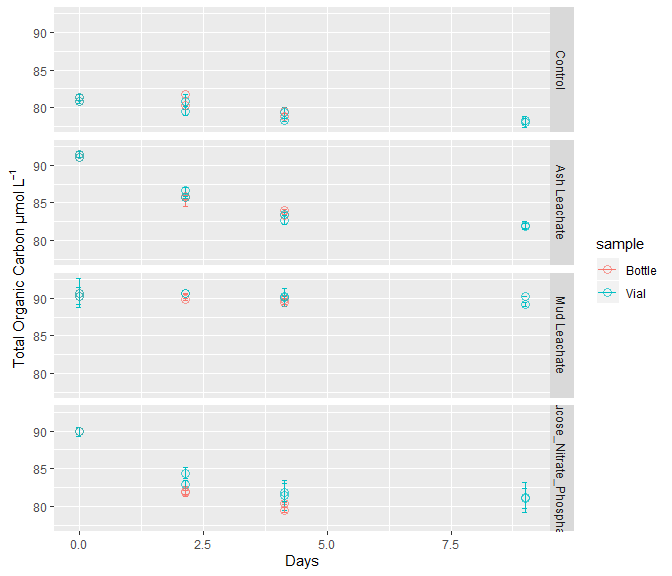
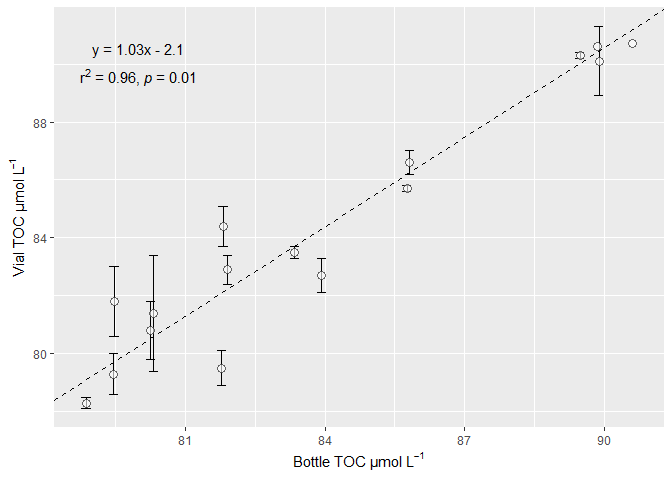
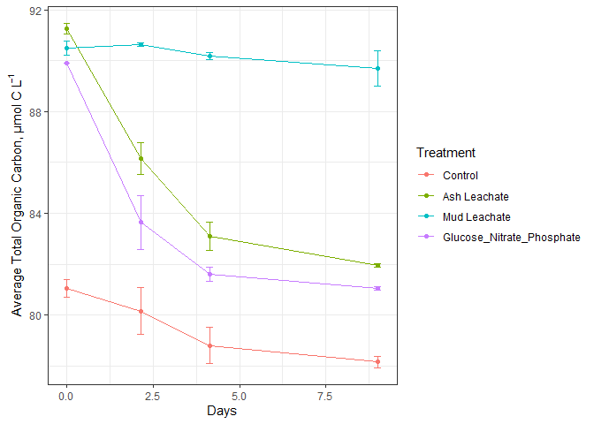
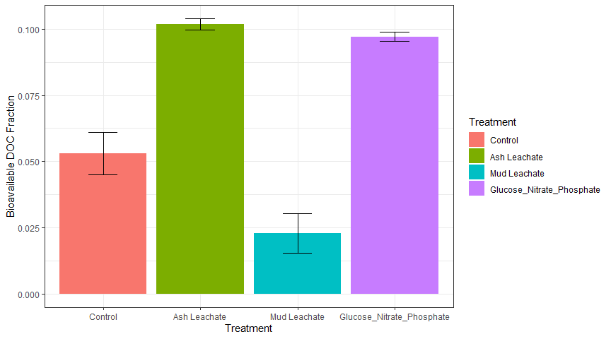
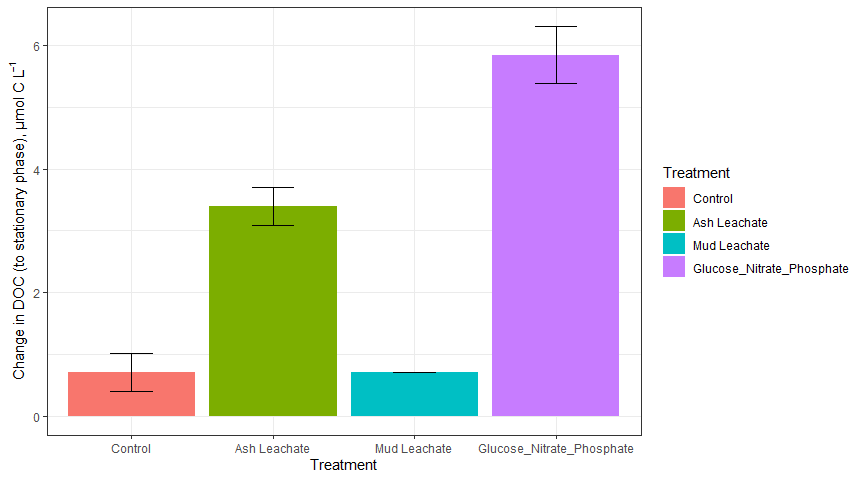
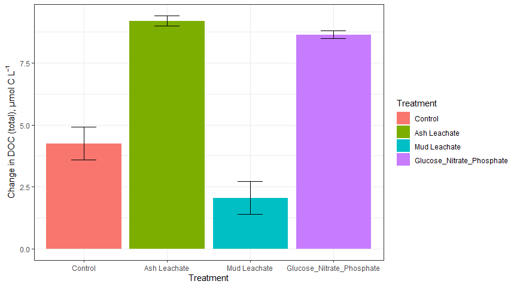
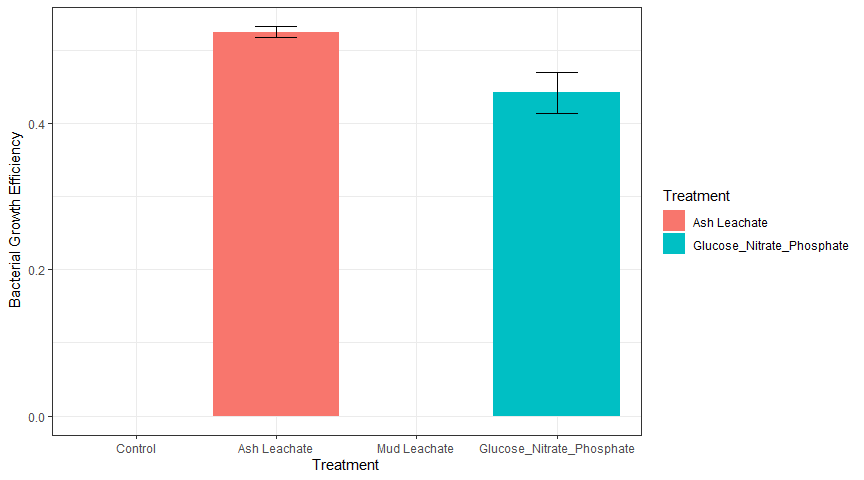
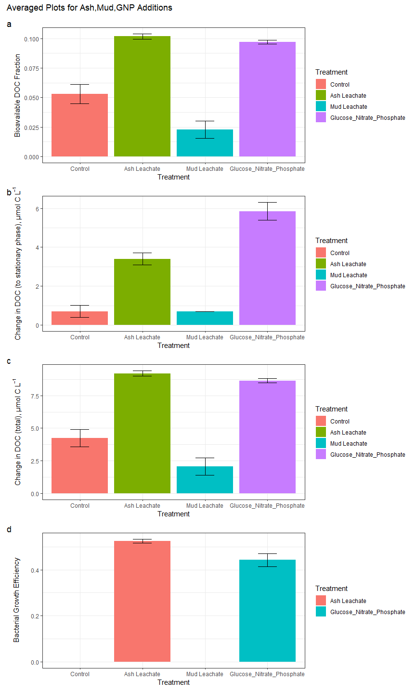

TOC and DOC Analysis
================
Kai Oda
11/2/2020

## Loading in the packages and data

Now, lets read in the two excel sheets

``` r
excel_sheets("../Input_Data/week4/144L_2018_Exp_TOC.xlsx")
```

    ## [1] "Metadata" "Data"

``` r
#Read in the metadata sheet
metadata <- read_excel("../Input_Data/week4/144L_2018_Exp_TOC.xlsx", sheet = "Metadata")

#Read in the data sheet
data <- read_excel("../Input_Data/week4/144L_2018_Exp_TOC.xlsx", sheet = "Data")

#Join the two datasets together 
joined <- left_join(metadata, data)
```

    ## Joining, by = c("Bottle", "Timepoint")

``` r
str(joined)
```

    ## Classes 'tbl_df', 'tbl' and 'data.frame':    80 obs. of  20 variables:
    ##  $ Experiment          : chr  "144L_2018" "144L_2018" "144L_2018" "144L_2018" ...
    ##  $ Location            : chr  "Campus Point" "Campus Point" "Campus Point" "Campus Point" ...
    ##  $ Temperature         : num  20 20 20 20 20 20 20 20 20 20 ...
    ##  $ Depth               : num  1 1 1 1 1 1 1 1 1 1 ...
    ##  $ Bottle              : chr  "A" "A" "A" "A" ...
    ##  $ Timepoint           : num  0 1 2 3 4 5 6 7 8 9 ...
    ##  $ Treatment           : chr  "Control" "Control" "Control" "Control" ...
    ##  $ Target_DOC_Amendment: num  0 0 0 0 0 0 0 0 0 0 ...
    ##  $ Inoculum_L          : num  1.5 1.5 1.5 1.5 1.5 1.5 1.5 1.5 1.5 1.5 ...
    ##  $ Media_L             : num  3.5 3.5 3.5 3.5 3.5 3.5 3.5 3.5 3.5 3.5 ...
    ##  $ Datetime            : chr  "2018-10-15T16:30" "2018-10-16T08:00" "2018-10-16T20:00" "2018-10-17T08:00" ...
    ##  $ TOC_Sample          : logi  TRUE FALSE FALSE FALSE TRUE FALSE ...
    ##  $ Parallel_Sample     : logi  TRUE FALSE FALSE FALSE TRUE FALSE ...
    ##  $ Cell_Sample         : logi  TRUE TRUE TRUE TRUE TRUE TRUE ...
    ##  $ DNA_Sample          : logi  TRUE FALSE FALSE FALSE TRUE FALSE ...
    ##  $ DNA_SampleID        : chr  "144_A0_S6" NA NA NA ...
    ##  $ TOC                 : num  81.3 NA NA NA 81.8 ...
    ##  $ TOC_sd              : num  0.4 NA NA NA NA ...
    ##  $ PTOC                : num  81.3 NA NA NA 79.5 NA NA NA 78.3 78 ...
    ##  $ PTOC_sd             : num  0.4 NA NA NA 0.6 NA NA NA 0.2 0.6 ...

After reading in our data, we want to perform some basic data wrangling
to create a “days” column by treatment and bottle We also want to subset
the data to only include our columns of interest.

``` r
toc <- joined %>% 
  mutate(Datetime = ymd_hm(Datetime)) %>% 
  group_by(Treatment, Bottle) %>%
  mutate(interv = interval(first(Datetime), Datetime), 
         dur = as.duration(interv), 
         days= as.numeric(dur, "days")) %>% 
  ungroup() %>% 
  rename(sd_TOC = TOC_sd, 
         sd_PTOC = PTOC_sd) %>% 
  select(everything(), -c(contains("Sample"), interv, dur))
  

str(toc)
```

    ## Classes 'tbl_df', 'tbl' and 'data.frame':    80 obs. of  16 variables:
    ##  $ Experiment          : chr  "144L_2018" "144L_2018" "144L_2018" "144L_2018" ...
    ##  $ Location            : chr  "Campus Point" "Campus Point" "Campus Point" "Campus Point" ...
    ##  $ Temperature         : num  20 20 20 20 20 20 20 20 20 20 ...
    ##  $ Depth               : num  1 1 1 1 1 1 1 1 1 1 ...
    ##  $ Bottle              : chr  "A" "A" "A" "A" ...
    ##  $ Timepoint           : num  0 1 2 3 4 5 6 7 8 9 ...
    ##  $ Treatment           : chr  "Control" "Control" "Control" "Control" ...
    ##  $ Target_DOC_Amendment: num  0 0 0 0 0 0 0 0 0 0 ...
    ##  $ Inoculum_L          : num  1.5 1.5 1.5 1.5 1.5 1.5 1.5 1.5 1.5 1.5 ...
    ##  $ Media_L             : num  3.5 3.5 3.5 3.5 3.5 3.5 3.5 3.5 3.5 3.5 ...
    ##  $ Datetime            : POSIXct, format: "2018-10-15 16:30:00" "2018-10-16 08:00:00" ...
    ##  $ TOC                 : num  81.3 NA NA NA 81.8 ...
    ##  $ sd_TOC              : num  0.4 NA NA NA NA ...
    ##  $ PTOC                : num  81.3 NA NA NA 79.5 NA NA NA 78.3 78 ...
    ##  $ sd_PTOC             : num  0.4 NA NA NA 0.6 NA NA NA 0.2 0.6 ...
    ##  $ days                : num  0 0.646 1.146 1.646 2.146 ...

*Note: For some reason, the interval() function does not behave as it
does in the videos. It returns two dates. I had to use the as.duration()
function to calculate the time between the dates, then the as.numeric()
function to convert that time into days.*

## Plotting TOC and DOC

It is beneficial to plot TOC and DOC on the same graph to visually check
for major differences.

``` r
pivot_toc <- toc %>% 
  select(Treatment, Bottle, days, TOC, PTOC)

#reduce rows and increase columns to have the values of TOC and PTOC in the same column
pivot_toc <- pivot_toc %>% 
  pivot_longer(TOC:PTOC, names_to="sample", values_to = "value")

pivot_toc_sd <- toc %>% 
  select(Treatment, Bottle, days, sd_TOC, sd_PTOC)  

## Do thte same thing for the sd
pivot_toc_sd <- pivot_toc_sd %>% 
  pivot_longer(sd_TOC:sd_PTOC, names_to="sample", names_prefix = "sd_", values_to = "sd")

## Combine the datsets and make the sample column easier to understand
pivoted <- left_join(pivot_toc, pivot_toc_sd) %>% 
  mutate(sample = ifelse(sample=="TOC", "Bottle", "Vial"))
```

    ## Joining, by = c("Treatment", "Bottle", "days", "sample")

``` r
## Set the order of variables for future graphs 
levels <- c("Control", "Ash Leachate", "Mud Leachate", "Glucose_Nitrate_Phosphate")

pivoted$Treatment <- factor(pivoted$Treatment, levels = levels)
pivoted$sample <- factor(pivoted$sample)
```

Now that our dataset is prepared we can begin plotting\!

``` r
pivoted %>% 
  drop_na(value) %>% 
  ggplot(aes(x=days, y=value, color=sample), group = interaction(Treatment, sample))+
  geom_errorbar(aes(ymin=value-sd, ymax = value+sd), width=0.1)+
  geom_point(shape=21, alpha=0.7, size=3)+
  labs(x="Days", y=expression("Total Organic Carbon µmol L"^-1))+
  facet_grid(rows = "Treatment")
```

    ## Warning: Removed 6 rows containing missing values (geom_errorbar).

<!-- --> From a
glance it appears that TOC measurements between the bottle and vials are
relatively similar. However, to ensure that they are statistically
comparable a more robust test is needed.

## Model II Linear Regression

Next, we want to compare the bottle and vial samples to determine
whether the measurements between the two are statistically similar.

A Model II linear regression assumes that both x and y are dependent
variables that are measured and have error. In this case, x will
represent TOC while y represents PTOC.

``` r
library(lmodel2)

## Drop na values and only include results after timepoint 0
toc_lm_data <- toc %>% 
  drop_na(TOC) %>% 
  filter(Timepoint > 0)

toc_lm <- lmodel2(PTOC ~ TOC, data=toc_lm_data, nperm=99)
```

    ## RMA was not requested: it will not be computed.

``` r
## Now, we save the values of intercept and slope. 
intercept <- toc_lm$regression.results[3,2]
slope <- toc_lm$regression.results[3,3]

## Now, we save the values of the CI for intercept and slope
two_int <- toc_lm$confidence.intervals[3,2]
two_slope <- toc_lm$confidence.intervals[3,4]

nine_int <- toc_lm$confidence.intervals[3,3]
nine_slope <- toc_lm$confidence.intervals[3,5]
```

Now, lets plot the TOC and PTOC values in ggplot

``` r
ggplot(toc_lm_data, aes(x=TOC, y=PTOC))+
  geom_errorbar(aes(ymin=PTOC-sd_PTOC, ymax = PTOC + sd_PTOC), width=0.2)+
  geom_point(shape=21, size=3, fill="white", alpha=0.6)+
  geom_abline(intercept=intercept, slope=slope, linetype=2)+
  geom_abline(intercept=two_int, slope=two_slope, linetype=2)+
  geom_abline(intercept=nine_int, slope=nine_slope, linetype=2)+
  labs(x=expression("Bottle TOC µmol L"^-1), y = expression("Vial TOC µmol L"^-1))+
  annotate(geom="text", label = expression(atop("y = 1.03x - 2.1", paste("r"^2," = 0.96, ", italic("p "), "= 0.01"))), x = 80, y=90, size=4)
```

    ## Warning: Removed 2 rows containing missing values (geom_errorbar).

    ## Warning in is.na(x): is.na() applied to non-(list or vector) of type
    ## 'expression'

<!-- -->

Most values can be explained by the regression line, p value is less
than 0.05. I take this to mean that the measurements between vials and
bottles were relatively similar. Therefore, this test us that the vial
measurements are representative of the TOC concentrations from the large
bottle. Thus, we can proceed with calculating DOC from the TOC values
from the vials.

## Calculating the DOC

To calculate the DOC = TOC - POC. Unfortunately, we need bactierial
carbon for POC. So let’s get to it\!

``` r
bc <- read_rds("../Bacterial_Abundance/bacterialCarbon.RDS")
merge <- left_join(toc, bc)
```

    ## Joining, by = c("Experiment", "Location", "Temperature", "Depth", "Bottle", "Timepoint", "Treatment", "Target_DOC_Amendment", "Inoculum_L", "Media_L", "Datetime", "days")

``` r
## In the next chunk we reorder the variabls so that time dependent variables appear first. Values that are not time dependent follow these time dependent variables 
merge <- merge %>% 
  select(Experiment:days, TOC:sd_PTOC, cells_L:delta_cells, bc, avg_bc, sd_bc, everything(), -c(contains("Sample"))) %>% 
  group_by(Treatment, Bottle) %>% 
  fill(exp_start:avg_lag_phase_dur) %>% 
  ungroup()
## We also fill in some missing values 

glimpse(merge)
```

    ## Observations: 80
    ## Variables: 47
    ## $ Experiment           <chr> "144L_2018", "144L_2018", "144L_2018", "144L_2...
    ## $ Location             <chr> "Campus Point", "Campus Point", "Campus Point"...
    ## $ Temperature          <dbl> 20, 20, 20, 20, 20, 20, 20, 20, 20, 20, 20, 20...
    ## $ Depth                <dbl> 1, 1, 1, 1, 1, 1, 1, 1, 1, 1, 1, 1, 1, 1, 1, 1...
    ## $ Bottle               <chr> "A", "A", "A", "A", "A", "A", "A", "A", "A", "...
    ## $ Timepoint            <dbl> 0, 1, 2, 3, 4, 5, 6, 7, 8, 9, 0, 1, 2, 3, 4, 5...
    ## $ Treatment            <chr> "Control", "Control", "Control", "Control", "C...
    ## $ Target_DOC_Amendment <dbl> 0, 0, 0, 0, 0, 0, 0, 0, 0, 0, 0, 0, 0, 0, 0, 0...
    ## $ Inoculum_L           <dbl> 1.5, 1.5, 1.5, 1.5, 1.5, 1.5, 1.5, 1.5, 1.5, 1...
    ## $ Media_L              <dbl> 3.5, 3.5, 3.5, 3.5, 3.5, 3.5, 3.5, 3.5, 3.5, 3...
    ## $ Datetime             <dttm> 2018-10-15 16:30:00, 2018-10-16 08:00:00, 201...
    ## $ TOC                  <dbl> 81.30000, NA, NA, NA, 81.77997, NA, NA, NA, 78...
    ## $ sd_TOC               <dbl> 0.40000000, NA, NA, NA, NA, NA, NA, NA, 0.3872...
    ## $ PTOC                 <dbl> 81.3, NA, NA, NA, 79.5, NA, NA, NA, 78.3, 78.0...
    ## $ sd_PTOC              <dbl> 0.4, NA, NA, NA, 0.6, NA, NA, NA, 0.2, 0.6, 0....
    ## $ days                 <dbl> 0.0000000, 0.6458333, 1.1458333, 1.6458333, 2....
    ## $ cells_L              <dbl> 332531522, 523943125, 859019934, 906998856, 93...
    ## $ interv               <Interval> 2018-10-15 16:30:00 UTC--2018-10-15 16:30...
    ## $ dur                  <Duration> 0s, 55800s (~15.5 hours), 99000s (~1.15 d...
    ## $ cells_sd             <dbl> 210649271, 210649271, 210649271, 210649271, 21...
    ## $ ln_cells             <dbl> 19.62225, 20.07689, 20.57130, 20.62565, 20.653...
    ## $ diff_ln_cells        <dbl> 0.000000000, 0.454648479, 0.494408990, 0.05434...
    ## $ exp_start            <dbl> 0, 0, 0, 0, 0, 0, 0, 0, 0, 0, 0, 0, 0, 0, 0, 0...
    ## $ exp_end              <dbl> 1, 1, 1, 1, 1, 1, 1, 1, 1, 1, 1, 1, 1, 1, 1, 1...
    ## $ ln_cells_exp_start   <dbl> 19.62225, 19.62225, 19.62225, 19.62225, 19.622...
    ## $ ln_cells_exp_end     <dbl> 20.07689, 20.07689, 20.07689, 20.07689, 20.076...
    ## $ cells_exp_start      <dbl> 332531522, 332531522, 332531522, 332531522, 33...
    ## $ cells_exp_end        <dbl> 523943125, 523943125, 523943125, 523943125, 52...
    ## $ days_exp_start       <dbl> 0, 0, 0, 0, 0, 0, 0, 0, 0, 0, 0, 0, 0, 0, 0, 0...
    ## $ days_exp_end         <dbl> 0.6458333, 0.6458333, 0.6458333, 0.6458333, 0....
    ## $ mew                  <dbl> 0.7039718, 0.7039718, 0.7039718, 0.7039718, 0....
    ## $ doubling_time        <dbl> 0.9846235, 0.9846235, 0.9846235, 0.9846235, 0....
    ## $ delta_cells          <dbl> 191411603, 191411603, 191411603, 191411603, 19...
    ## $ bc                   <dbl> 0.8313288, 1.3098578, 2.1475498, 2.2674971, 2....
    ## $ avg_bc               <dbl> 0.9022187, 1.3301541, 1.9535757, 2.3515191, 2....
    ## $ sd_bc                <dbl> 0.10025342, 0.02870334, 0.27432087, 0.11882499...
    ## $ Cells_ml             <dbl> 332531.5, 523943.1, 859019.9, 906998.9, 933025...
    ## $ deltaBc              <dbl> 0.4785290, 0.4785290, 0.4785290, 0.4785290, 0....
    ## $ avg_mew              <dbl> 0.6056875, 0.6056875, 0.6056875, 0.6056875, 0....
    ## $ sd_mew               <dbl> 0.10113376, 0.10113376, 0.10113376, 0.10113376...
    ## $ avg_doubling_time    <dbl> 1.1753457, 1.1753457, 1.1753457, 1.1753457, 1....
    ## $ sd_doubling_time     <dbl> 0.196251588, 0.196251588, 0.196251588, 0.19625...
    ## $ avg_delta_cells      <dbl> 171174186, 171174186, 171174186, 171174186, 17...
    ## $ sd_delta_cells       <dbl> 20824130, 20824130, 20824130, 20824130, 208241...
    ## $ avg_delta_bc         <dbl> 0.4279355, 0.4279355, 0.4279355, 0.4279355, 0....
    ## $ sd_delta_bc          <dbl> 0.05206033, 0.05206033, 0.05206033, 0.05206033...
    ## $ avg_lag_phase_dur    <dbl> 0, 0, 0, 0, 0, 0, 0, 0, 0, 0, 0, 0, 0, 0, 0, 0...

Bactieral abundance/TOC from vial samples were not taken at every
timepoint. In some cases we have a TOC sample but no bacterial carbon
sample (or vice versa). We want to use an interpolation function to fill
in the missing values between two known values for TOC and bacterial
carbon (POC) so that we can compute DOC for a greater number of
timepoints.

``` r
## Select the variables of interest...
to_interpolate <- merge %>% 
  select(Experiment, Treatment, Bottle, Timepoint, days, PTOC, bc) %>% 
  group_by(Treatment, Bottle)

## Use the group_split() function to break the dataset into a list (data type)
## The list is split up by the grouped elements (Treatment, Bottle)
list <- to_interpolate %>% 
  group_split()

## Generate the keys, (Treatment, Bottle)
keys <- to_interpolate %>% 
  group_keys() %>% 
  mutate(key = paste(Treatment, Bottle))

## Change the name of the list elements to the generated key values 
names(list) <- keys$key
```

### Writing the function

``` r
library(zoo)
```

    ## Warning: package 'zoo' was built under R version 3.6.3

    ## 
    ## Attaching package: 'zoo'

    ## The following objects are masked from 'package:base':
    ## 
    ##     as.Date, as.Date.numeric

``` r
## Interpolates the toc and POC values, joins them together with cbind() and converts the matrix to a tbl with as_tibble()
interp.funct <- function(x) {
  y <- zoo(x, order.by = x$days)
  interp_toc <- round(as.numeric(na.approx(y$PTOC, na.rm=F)), 1)
  interp_bc <- round(as.numeric(na.approx(y$bc, na.rm=F)), 1)
  z <- cbind(y, interp_toc, interp_bc)
  as_tibble(z)
}
```

## Apply the function and combine the columns into the main dataset

``` r
## lapply() takes a list and applies a function to each element in the list 
## We also need to convert numeric variables (they are chrs by default from as_tibble())
interpolated <- lapply(list, interp.funct) %>% 
  plyr::ldply(., as.data.frame) %>% 
  select(-c(.id, PTOC, bc, days)) %>% 
  mutate_at(vars(Timepoint:interp_bc), as.numeric) %>% 
  left_join(merge, .)
```

    ## Warning: Calling `as_tibble()` on a vector is discouraged, because the behavior is likely to change in the future. Use `tibble::enframe(name = NULL)` instead.
    ## This warning is displayed once per session.

    ## Joining, by = c("Experiment", "Bottle", "Timepoint", "Treatment")

``` r
## Now we can see the MASSIVE dataframe with the interpolated values :) 
glimpse(interpolated)
```

    ## Observations: 80
    ## Variables: 49
    ## $ Experiment           <chr> "144L_2018", "144L_2018", "144L_2018", "144L_2...
    ## $ Location             <chr> "Campus Point", "Campus Point", "Campus Point"...
    ## $ Temperature          <dbl> 20, 20, 20, 20, 20, 20, 20, 20, 20, 20, 20, 20...
    ## $ Depth                <dbl> 1, 1, 1, 1, 1, 1, 1, 1, 1, 1, 1, 1, 1, 1, 1, 1...
    ## $ Bottle               <chr> "A", "A", "A", "A", "A", "A", "A", "A", "A", "...
    ## $ Timepoint            <dbl> 0, 1, 2, 3, 4, 5, 6, 7, 8, 9, 0, 1, 2, 3, 4, 5...
    ## $ Treatment            <chr> "Control", "Control", "Control", "Control", "C...
    ## $ Target_DOC_Amendment <dbl> 0, 0, 0, 0, 0, 0, 0, 0, 0, 0, 0, 0, 0, 0, 0, 0...
    ## $ Inoculum_L           <dbl> 1.5, 1.5, 1.5, 1.5, 1.5, 1.5, 1.5, 1.5, 1.5, 1...
    ## $ Media_L              <dbl> 3.5, 3.5, 3.5, 3.5, 3.5, 3.5, 3.5, 3.5, 3.5, 3...
    ## $ Datetime             <dttm> 2018-10-15 16:30:00, 2018-10-16 08:00:00, 201...
    ## $ TOC                  <dbl> 81.30000, NA, NA, NA, 81.77997, NA, NA, NA, 78...
    ## $ sd_TOC               <dbl> 0.40000000, NA, NA, NA, NA, NA, NA, NA, 0.3872...
    ## $ PTOC                 <dbl> 81.3, NA, NA, NA, 79.5, NA, NA, NA, 78.3, 78.0...
    ## $ sd_PTOC              <dbl> 0.4, NA, NA, NA, 0.6, NA, NA, NA, 0.2, 0.6, 0....
    ## $ days                 <dbl> 0.0000000, 0.6458333, 1.1458333, 1.6458333, 2....
    ## $ cells_L              <dbl> 332531522, 523943125, 859019934, 906998856, 93...
    ## $ interv               <Interval> 2018-10-15 16:30:00 UTC--2018-10-15 16:30...
    ## $ dur                  <Duration> 0s, 55800s (~15.5 hours), 99000s (~1.15 d...
    ## $ cells_sd             <dbl> 210649271, 210649271, 210649271, 210649271, 21...
    ## $ ln_cells             <dbl> 19.62225, 20.07689, 20.57130, 20.62565, 20.653...
    ## $ diff_ln_cells        <dbl> 0.000000000, 0.454648479, 0.494408990, 0.05434...
    ## $ exp_start            <dbl> 0, 0, 0, 0, 0, 0, 0, 0, 0, 0, 0, 0, 0, 0, 0, 0...
    ## $ exp_end              <dbl> 1, 1, 1, 1, 1, 1, 1, 1, 1, 1, 1, 1, 1, 1, 1, 1...
    ## $ ln_cells_exp_start   <dbl> 19.62225, 19.62225, 19.62225, 19.62225, 19.622...
    ## $ ln_cells_exp_end     <dbl> 20.07689, 20.07689, 20.07689, 20.07689, 20.076...
    ## $ cells_exp_start      <dbl> 332531522, 332531522, 332531522, 332531522, 33...
    ## $ cells_exp_end        <dbl> 523943125, 523943125, 523943125, 523943125, 52...
    ## $ days_exp_start       <dbl> 0, 0, 0, 0, 0, 0, 0, 0, 0, 0, 0, 0, 0, 0, 0, 0...
    ## $ days_exp_end         <dbl> 0.6458333, 0.6458333, 0.6458333, 0.6458333, 0....
    ## $ mew                  <dbl> 0.7039718, 0.7039718, 0.7039718, 0.7039718, 0....
    ## $ doubling_time        <dbl> 0.9846235, 0.9846235, 0.9846235, 0.9846235, 0....
    ## $ delta_cells          <dbl> 191411603, 191411603, 191411603, 191411603, 19...
    ## $ bc                   <dbl> 0.8313288, 1.3098578, 2.1475498, 2.2674971, 2....
    ## $ avg_bc               <dbl> 0.9022187, 1.3301541, 1.9535757, 2.3515191, 2....
    ## $ sd_bc                <dbl> 0.10025342, 0.02870334, 0.27432087, 0.11882499...
    ## $ Cells_ml             <dbl> 332531.5, 523943.1, 859019.9, 906998.9, 933025...
    ## $ deltaBc              <dbl> 0.4785290, 0.4785290, 0.4785290, 0.4785290, 0....
    ## $ avg_mew              <dbl> 0.6056875, 0.6056875, 0.6056875, 0.6056875, 0....
    ## $ sd_mew               <dbl> 0.10113376, 0.10113376, 0.10113376, 0.10113376...
    ## $ avg_doubling_time    <dbl> 1.1753457, 1.1753457, 1.1753457, 1.1753457, 1....
    ## $ sd_doubling_time     <dbl> 0.196251588, 0.196251588, 0.196251588, 0.19625...
    ## $ avg_delta_cells      <dbl> 171174186, 171174186, 171174186, 171174186, 17...
    ## $ sd_delta_cells       <dbl> 20824130, 20824130, 20824130, 20824130, 208241...
    ## $ avg_delta_bc         <dbl> 0.4279355, 0.4279355, 0.4279355, 0.4279355, 0....
    ## $ sd_delta_bc          <dbl> 0.05206033, 0.05206033, 0.05206033, 0.05206033...
    ## $ avg_lag_phase_dur    <dbl> 0, 0, 0, 0, 0, 0, 0, 0, 0, 0, 0, 0, 0, 0, 0, 0...
    ## $ interp_toc           <dbl> 81.3, 80.8, 80.3, 79.9, 79.5, 79.2, 78.9, 78.6...
    ## $ interp_bc            <dbl> 0.8, 1.3, 2.1, 2.3, 2.3, 2.2, 2.0, 2.0, 2.4, 2...

## Calculating Derived Variables

Now that we have our interpolated TOC and POC values we want to
calculate a bunch of values related to DOC and BGE (bacterial growth
efficiency).

``` r
doc <- interpolated %>% 
  mutate(doc = interp_toc - interp_bc) %>% 
  group_by(Treatment, Bottle) %>% 
  mutate(
    bioav_doc = (first(doc) - last(na.omit(doc))) / first(doc), 
    doc_exp_end = ifelse(Timepoint == exp_end, doc, NA), 
    delta_doc = first(doc) - doc_exp_end, 
    tdelta_doc = first(doc) - last(na.omit(doc)), 
    bge = ifelse(delta_doc > 1.5, deltaBc/delta_doc, NA)
  ) %>% 
  fill(bioav_doc:bge, .direction = "downup") %>% 
  ungroup()

## Don't forget to fill the columns!

subset <- doc %>% 
  select(Treatment, Bottle, Timepoint, doc, bioav_doc, doc_exp_end, delta_doc, tdelta_doc, bge)

str(doc)
```

    ## Classes 'tbl_df', 'tbl' and 'data.frame':    80 obs. of  55 variables:
    ##  $ Experiment          : chr  "144L_2018" "144L_2018" "144L_2018" "144L_2018" ...
    ##  $ Location            : chr  "Campus Point" "Campus Point" "Campus Point" "Campus Point" ...
    ##  $ Temperature         : num  20 20 20 20 20 20 20 20 20 20 ...
    ##  $ Depth               : num  1 1 1 1 1 1 1 1 1 1 ...
    ##  $ Bottle              : chr  "A" "A" "A" "A" ...
    ##  $ Timepoint           : num  0 1 2 3 4 5 6 7 8 9 ...
    ##  $ Treatment           : chr  "Control" "Control" "Control" "Control" ...
    ##  $ Target_DOC_Amendment: num  0 0 0 0 0 0 0 0 0 0 ...
    ##  $ Inoculum_L          : num  1.5 1.5 1.5 1.5 1.5 1.5 1.5 1.5 1.5 1.5 ...
    ##  $ Media_L             : num  3.5 3.5 3.5 3.5 3.5 3.5 3.5 3.5 3.5 3.5 ...
    ##  $ Datetime            : POSIXct, format: "2018-10-15 16:30:00" "2018-10-16 08:00:00" ...
    ##  $ TOC                 : num  81.3 NA NA NA 81.8 ...
    ##  $ sd_TOC              : num  0.4 NA NA NA NA ...
    ##  $ PTOC                : num  81.3 NA NA NA 79.5 NA NA NA 78.3 78 ...
    ##  $ sd_PTOC             : num  0.4 NA NA NA 0.6 NA NA NA 0.2 0.6 ...
    ##  $ days                : num  0 0.646 1.146 1.646 2.146 ...
    ##  $ cells_L             : num  3.33e+08 5.24e+08 8.59e+08 9.07e+08 9.33e+08 ...
    ##  $ interv              :Formal class 'Interval' [package "lubridate"] with 3 slots
    ##   .. ..@ .Data: num  0 55800 99000 142200 185400 ...
    ##   .. ..@ start: POSIXct, format: "2018-10-15 16:30:00" "2018-10-15 16:30:00" ...
    ##   .. ..@ tzone: chr "UTC"
    ##  $ dur                 :Formal class 'Duration' [package "lubridate"] with 1 slot
    ##   .. ..@ .Data: num  0 55800 99000 142200 185400 ...
    ##  $ cells_sd            : num  2.11e+08 2.11e+08 2.11e+08 2.11e+08 2.11e+08 ...
    ##  $ ln_cells            : num  19.6 20.1 20.6 20.6 20.7 ...
    ##  $ diff_ln_cells       : num  0 0.4546 0.4944 0.0543 0.0283 ...
    ##  $ exp_start           : num  0 0 0 0 0 0 0 0 0 0 ...
    ##  $ exp_end             : num  1 1 1 1 1 1 1 1 1 1 ...
    ##  $ ln_cells_exp_start  : num  19.6 19.6 19.6 19.6 19.6 ...
    ##  $ ln_cells_exp_end    : num  20.1 20.1 20.1 20.1 20.1 ...
    ##  $ cells_exp_start     : num  3.33e+08 3.33e+08 3.33e+08 3.33e+08 3.33e+08 ...
    ##  $ cells_exp_end       : num  5.24e+08 5.24e+08 5.24e+08 5.24e+08 5.24e+08 ...
    ##  $ days_exp_start      : num  0 0 0 0 0 0 0 0 0 0 ...
    ##  $ days_exp_end        : num  0.646 0.646 0.646 0.646 0.646 ...
    ##  $ mew                 : num  0.704 0.704 0.704 0.704 0.704 ...
    ##  $ doubling_time       : num  0.985 0.985 0.985 0.985 0.985 ...
    ##  $ delta_cells         : num  1.91e+08 1.91e+08 1.91e+08 1.91e+08 1.91e+08 ...
    ##  $ bc                  : num  0.831 1.31 2.148 2.267 2.333 ...
    ##  $ avg_bc              : num  0.902 1.33 1.954 2.352 2.549 ...
    ##  $ sd_bc               : num  0.1003 0.0287 0.2743 0.1188 0.3067 ...
    ##  $ Cells_ml            : num  332532 523943 859020 906999 933025 ...
    ##  $ deltaBc             : num  0.479 0.479 0.479 0.479 0.479 ...
    ##  $ avg_mew             : num  0.606 0.606 0.606 0.606 0.606 ...
    ##  $ sd_mew              : num  0.101 0.101 0.101 0.101 0.101 ...
    ##  $ avg_doubling_time   : num  1.18 1.18 1.18 1.18 1.18 ...
    ##  $ sd_doubling_time    : num  0.196 0.196 0.196 0.196 0.196 ...
    ##  $ avg_delta_cells     : num  1.71e+08 1.71e+08 1.71e+08 1.71e+08 1.71e+08 ...
    ##  $ sd_delta_cells      : num  20824130 20824130 20824130 20824130 20824130 ...
    ##  $ avg_delta_bc        : num  0.428 0.428 0.428 0.428 0.428 ...
    ##  $ sd_delta_bc         : num  0.0521 0.0521 0.0521 0.0521 0.0521 ...
    ##  $ avg_lag_phase_dur   : num  0 0 0 0 0 0 0 0 0 0 ...
    ##  $ interp_toc          : num  81.3 80.8 80.3 79.9 79.5 79.2 78.9 78.6 78.3 78 ...
    ##  $ interp_bc           : num  0.8 1.3 2.1 2.3 2.3 2.2 2 2 2.4 2.4 ...
    ##  $ doc                 : num  80.5 79.5 78.2 77.6 77.2 77 76.9 76.6 75.9 75.6 ...
    ##  $ bioav_doc           : num  0.0609 0.0609 0.0609 0.0609 0.0609 ...
    ##  $ doc_exp_end         : num  79.5 79.5 79.5 79.5 79.5 79.5 79.5 79.5 79.5 79.5 ...
    ##  $ delta_doc           : num  1 1 1 1 1 1 1 1 1 1 ...
    ##  $ tdelta_doc          : num  4.9 4.9 4.9 4.9 4.9 ...
    ##  $ bge                 : num  NA NA NA NA NA NA NA NA NA NA ...

## Plotting average derived values

We’ve calculated DOC and a bunch of other variables. It is beneficial to
see the averaged values across treatments and timepoints where
applicable. First, we need to generate a datset containing the derived
variables.

``` r
averages <- doc %>% 
  group_by(Treatment, Timepoint) %>% 
  mutate(avg_toc = mean(PTOC), 
         sd_toc = sd(PTOC)) %>% 
  ungroup() %>% 
  group_by(Treatment) %>%
  mutate(
    avg_bioav_doc = mean(bioav_doc),
    sd_bioav_doc = sd(bioav_doc),
    avg_delta_doc = mean(delta_doc),
    sd_delta_doc = sd(delta_doc),
    avg_tdelta_doc = mean(tdelta_doc),
    sd_tdelta_doc = sd(tdelta_doc),
    avg_bge = mean(bge),
    sd_bge = sd(bge)
  ) %>% 
  ungroup()
```

We have calculated the average values and added them to our giant
dataset. Now, we want to plot these average values.

## Plotting average values with ggplot

First, lets plot the average TOC values for each treatment

``` r
levels <- c("Control", "Ash Leachate", "Mud Leachate", "Glucose_Nitrate_Phosphate")

averages$Treatment <- factor(averages$Treatment, levels = levels)

averages %>% 
  mutate(Treatment = factor(Treatment)) %>% 
  drop_na(avg_toc) %>% 
  ggplot(aes(x=days, y = avg_toc, color = Treatment), group = interaction(Treatment)) +
  geom_errorbar(aes(ymin=avg_toc - sd_toc, ymax = avg_toc + sd_toc), width = 0.2)+
  geom_point()+
  geom_line()+
  labs(x="Days", y = expression("Average Total Organic Carbon, µmol C L"^-1))+
  theme_bw()
```

<!-- --> The two
treatments with the highest growth rate/bacterial abundance (ash
leachate and GNP), experienced the greatest decrease in TOC over the
course of the experiment. This likely indicates that they used the
available carbon to increase their biomass. Mud leachate treatment
started at around the same level but little C was actually taken up by
the microbes.

Now, we’ll make bar plots for the remaining averaged variables

``` r
bar_data <- averages %>% 
  select(Treatment, avg_bioav_doc:sd_bge) %>% 
  distinct()
```

**Average bioavailable DOC**

``` r
bioav_doc_graph <- bar_data %>% 
  ggplot(aes(x=Treatment, y=avg_bioav_doc))+
  geom_col(aes(fill=Treatment))+
  geom_errorbar(aes(ymin = avg_bioav_doc - sd_bioav_doc, ymax = avg_bioav_doc + sd_bioav_doc), width=0.3)+
  labs(y="Bioavailable DOC Fraction")+
  theme_bw()


bioav_doc_graph
```

<!-- --> It appears
that ash leachate and GNP treatments had the highest bioavailable DOC
fraction. This is in line with the increased growth rates and large
decrease in TOC over the course of the experiment. Interestingly, mud
leachate treatments had a lower bioavailable doc fraction when compared
to the control. This seems to indicate that there is not much
bioavailable carbon in mud leachate.

**Average Change in DOC**

``` r
delta_doc_graph <- bar_data %>% 
  ggplot(aes(x=Treatment, y=avg_delta_doc))+
  geom_col(aes(fill=Treatment))+
  geom_errorbar(aes(ymin = avg_delta_doc - sd_delta_doc, ymax = avg_delta_doc + sd_delta_doc), width=0.3)+
  labs(y=expression("Change in DOC (to stationary phase), µmol C L"^-1))+
  theme_bw()


delta_doc_graph
```

<!-- --> Ash
leachate and GNP treatments have the highest change in DOC, seeming to
indicate that they made the greatest use of the available carbon to
increase their biomass.

**Average Change in DOC (total)**

``` r
tdelta_doc_graph <- bar_data %>% 
  ggplot(aes(x=Treatment, y=avg_tdelta_doc))+
  geom_col(aes(fill=Treatment))+
  geom_errorbar(aes(ymin = avg_tdelta_doc - sd_tdelta_doc, ymax = avg_tdelta_doc + sd_tdelta_doc), width=0.3)+
  labs(y=expression("Change in DOC (total), µmol C L"^-1))+
  theme_bw()


tdelta_doc_graph
```

<!-- --> \*\*See
above explanation, results are similar.

**Average BGE (total)**

``` r
bge_graph <- bar_data %>% 
  ggplot(aes(x=Treatment, y=avg_bge))+
  geom_col(aes(fill=Treatment))+
  geom_errorbar(aes(ymin = avg_bge - sd_bge, ymax = avg_bge + sd_bge), width=0.3)+
  labs(y=expression("Bacterial Growth Efficiency"))+
  theme_bw()


bge_graph
```

    ## Warning: Removed 2 rows containing missing values (position_stack).

    ## Warning: Removed 2 rows containing missing values (geom_errorbar).

<!-- --> It seems
odd that there is no BGE for control or mud leachate treatments.
However, this has to do with the way we calcualted BGE. Since the
detection limit is \> 1.5, we assigned NA values if the change in DOC
concentrations was less than that. Control and mud leachate treatments
did not exceed this detection limit, thus no BGE values are available.
With that out of the way, ash leachate has a slightly higher BGE,
indicating that a greater percentage of nutrients were used to increase
biomass in this treatment though a more robust statistical test is
needed to say whether this is a significant increase over the GNP
treatment.

Now, we can display all the graphs at once with pathwork()

``` r
library(patchwork)
```

    ## Warning: package 'patchwork' was built under R version 3.6.3

``` r
bioav_doc_graph / delta_doc_graph / tdelta_doc_graph / bge_graph + plot_annotation(title="Averaged Plots for Ash,Mud,GNP Additions", tag_levels="a")
```

    ## Warning: Removed 2 rows containing missing values (position_stack).

    ## Warning: Removed 2 rows containing missing values (geom_errorbar).

<!-- -->

``` r
saveRDS(averages, "averaged_DOC_dataset.RDS")
```
