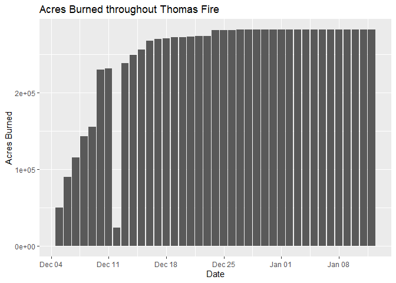
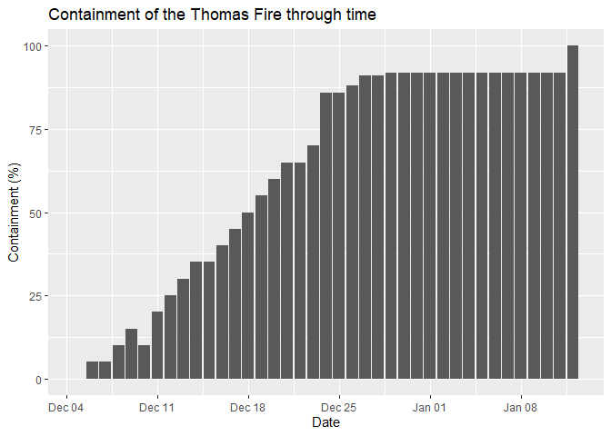
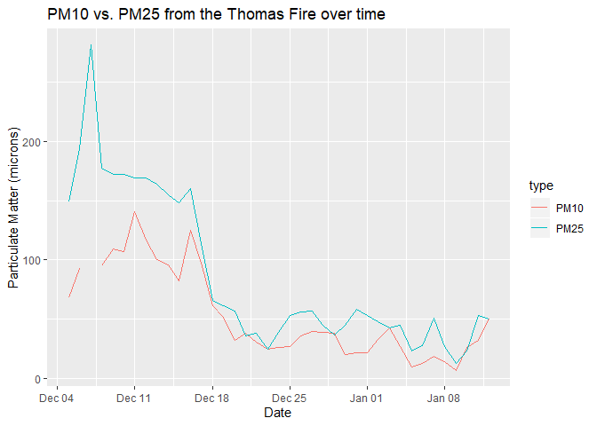

Thomas Fire Progression (Kai Oda)
================

## Loading the data

``` r
fire_data <- read_excel("../Input_Data/week1/Thomas_Fire_Progression.xlsx", sheet="Data")
metadata <- read_excel("../Input_Data/week1/Thomas_Fire_Progression.xlsx", sheet="Metadata")
```

## Exploring the data

``` r
glimpse(fire_data)
```

    ## Observations: 39
    ## Variables: 5
    ## $ Date         <dttm> 2017-12-05, 2017-12-06, 2017-12-07, 2017-12-08, 2017-...
    ## $ Acres_Burned <dbl> 50000, 90000, 115000, 143000, 155000, 230000, 231700, ...
    ## $ Containment  <dbl> 0, 5, 5, 10, 15, 10, 20, 25, 30, 35, 35, 40, 45, 50, 5...
    ## $ PM10         <dbl> 68, 93, NA, 95, 109, 107, 141, 117, 100, 96, 82, 125, ...
    ## $ PM25         <dbl> 149, 194, 281, 177, 172, 172, 169, 169, 164, 155, 148,...

``` r
# It seems like the str() function is more useful bc it gives you the data type of each column 
str(fire_data)
```

    ## Classes 'tbl_df', 'tbl' and 'data.frame':    39 obs. of  5 variables:
    ##  $ Date        : POSIXct, format: "2017-12-05" "2017-12-06" ...
    ##  $ Acres_Burned: num  50000 90000 115000 143000 155000 ...
    ##  $ Containment : num  0 5 5 10 15 10 20 25 30 35 ...
    ##  $ PM10        : num  68 93 NA 95 109 107 141 117 100 96 ...
    ##  $ PM25        : num  149 194 281 177 172 172 169 169 164 155 ...

``` r
#Look at first six rows
head(fire_data)
```

    ## # A tibble: 6 x 5
    ##   Date                Acres_Burned Containment  PM10  PM25
    ##   <dttm>                     <dbl>       <dbl> <dbl> <dbl>
    ## 1 2017-12-05 00:00:00        50000           0    68   149
    ## 2 2017-12-06 00:00:00        90000           5    93   194
    ## 3 2017-12-07 00:00:00       115000           5    NA   281
    ## 4 2017-12-08 00:00:00       143000          10    95   177
    ## 5 2017-12-09 00:00:00       155000          15   109   172
    ## 6 2017-12-10 00:00:00       230000          10   107   172

``` r
#Get the dimensions of the dataset
dim(fire_data)
```

    ## [1] 39  5

``` r
## 39 rows, 5 columns 
```

## Manipulating the dataframe

Summarizing the data by columns

``` r
summary_data1 <- select(fire_data, c(Acres_Burned, Containment, PM10, PM25))

# Checking my dataset to see if there is na values...
sum_data <- summarise_all(summary_data1, ~sum(is.na(.)))

# Removing rows that contain na values 
summary_data1 <- na.omit(summary_data1)

# Calculating mean and variance for all numeric variables 
mean_data <- summarise_all(summary_data1, mean)
mean_data
```

    ## # A tibble: 1 x 4
    ##   Acres_Burned Containment  PM10  PM25
    ##          <dbl>       <dbl> <dbl> <dbl>
    ## 1      249375.        64.9  53.0  80.9

``` r
var_data <- summarise_all(summary_data1, var)
var_data
```

    ## # A tibble: 1 x 4
    ##   Acres_Burned Containment  PM10  PM25
    ##          <dbl>       <dbl> <dbl> <dbl>
    ## 1  4384645320.       1044. 1389. 3357.

``` r
## Practice renaming the column names
rename(summary_data1, acres_burned = Acres_Burned, containment = Containment, pm10 = PM10, pm25 = PM25)
```

    ## # A tibble: 38 x 4
    ##    acres_burned containment  pm10  pm25
    ##           <dbl>       <dbl> <dbl> <dbl>
    ##  1        50000           0    68   149
    ##  2        90000           5    93   194
    ##  3       143000          10    95   177
    ##  4       155000          15   109   172
    ##  5       230000          10   107   172
    ##  6       231700          20   141   169
    ##  7        23600          25   117   169
    ##  8       238500          30   100   164
    ##  9       249500          35    96   155
    ## 10       256000          35    82   148
    ## # ... with 28 more rows

## Plots

**Plotting the acres burned by date**

``` r
ggplot(fire_data, aes(x=Date, y=Acres_Burned))+
  geom_col()+
  labs(y="Acres Burned", title="Acres Burned throughout Thomas Fire")
```

<!-- -->

This figure gives me an overview of how the Thomas Fire spread. We can
see an exponential increase in acres burned in the first week, and then
the destruction eventually leveling off. One interesting thing is that
the “Acres\_Burned” plummets down to a very low number write on Dec 12.
Perhaps this is an error in the dataset?

**Plotting containment by date**

``` r
ggplot(fire_data, aes(x=Date, y=Containment))+
  geom_col()+
  labs(y="Containment (%)", title="Containment of the Thomas Fire through time")
```

<!-- -->

This graph simply gives us an idea of how long it took to contain the
Thomas Fire. We can see that containment increase was mostly linear
rather than exponential which is somewhat interesting.

**Plotting particulate matter on same graph**

``` r
#Restructuring the fire_data dataset so that both PM10 and PM25 can be displayed on the same graph 
## I assign both particulates to the same column, and create a new column that labels each value as either PM10 or PM25
pm_df <- fire_data %>%  
  select(Date, PM10, PM25) %>% 
  gather(key="type", value="amount", -Date)

ggplot(pm_df, aes(x=Date, y=amount, color=type))+
  geom_line()+
  labs(y="Particulate Matter (microns)", title="PM10 vs. PM25 from the Thomas Fire over time")
```

<!-- -->

This graph shows how PM10 and PM25 vary throughout the Thomas Fire. Note
the PM25 spike in the early days of the fire. It is also interesting
that PM25 values fall sharply after that to track closely with PM10
values after.
